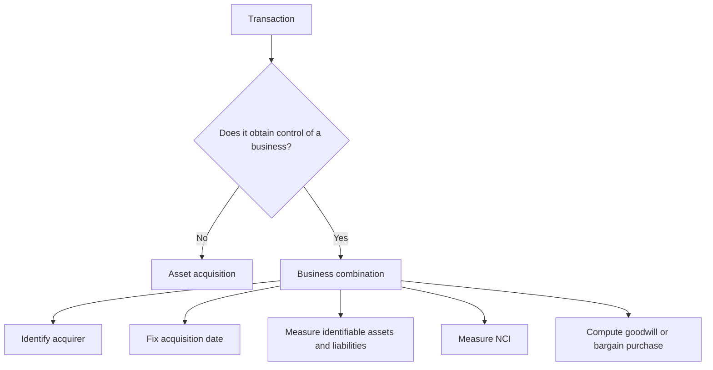
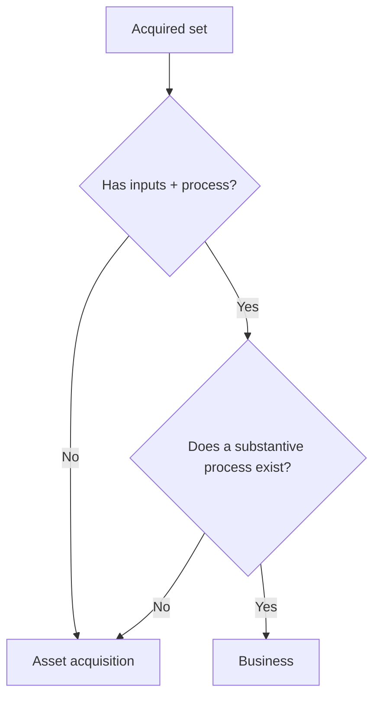
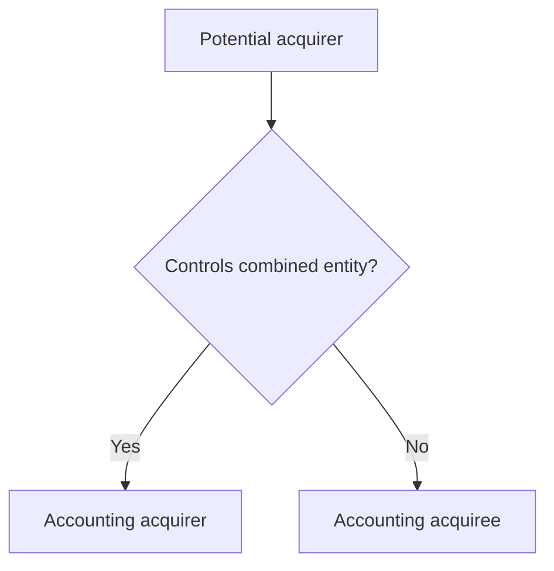

# Chapter 12: Ind AS 103 Business Combinations

## Exam Relevance

- This is the acquisition-accounting chapter the examiner uses to test whether a transaction is a business combination or only an asset acquisition.
- The most common scoring areas are the acquisition method, identifying the acquirer, acquisition date, goodwill or bargain purchase, and measurement of non-controlling interest.
- Questions often mix step acquisitions, contingent consideration, contingent liabilities, indemnification assets, reacquired rights, and common-control ideas.
- The answer usually turns on classification first, then measurement.

## Core Intuition

A business combination is not "buying assets". It is buying control of a business, so the accounting starts from control and then rebuilds the acquiree at fair value.

## Concept Map



## Key Concepts

### 1. Business Combination vs Asset Acquisition

Ind AS 103 applies only when the acquirer obtains control of a business.

A business is an integrated set of activities and assets capable of being run to provide goods or services, investment income, or other ordinary income.

If the transaction does not involve a business, it is an asset acquisition:

| Point | Business combination | Asset acquisition |
|---|---|---|
| Goodwill | Recognised | Not recognised |
| Identifiable intangibles | Recognised separately at fair value if identifiable | Allocated from total cost based on relative fair values |
| Transaction costs | Expensed | Usually capitalised into asset cost |
| Deferred tax | Recognised on fair value differences, subject to Ind AS rules | Normal initial-recognition logic applies |

### 2. Quick Classification Check

The practical question is whether the acquired set has inputs and a substantive process that can create outputs.



Useful exam signals:

- a trained workforce that performs a critical process,
- outputs already being produced,
- customer contracts and operating systems together,
- more than just a pile of assets with one identifiable asset taking almost all value.

The chapter also uses a concentration test as an optional shortcut. If substantially all of the fair value of gross assets is concentrated in a single identifiable asset or a group of similar assets, the transaction is usually an asset acquisition.

### 3. Acquisition Method

All business combinations within scope use the acquisition method, also called the purchase method.

The four working steps are:

1. Identify the acquirer.
2. Determine the acquisition date.
3. Recognise and measure identifiable assets, liabilities, and NCI.
4. Recognise goodwill or a gain on bargain purchase.

That is the order the examiner expects in a working note.

### 4. Identifying the Acquirer

The legal buyer and the accounting acquirer are not always the same.

The acquirer is the entity that obtains control. In equity-share deals, useful clues include:

- who gets the larger voting power in the combined entity,
- who can appoint or remove the majority of the governing body,
- whose management dominates the combined entity,
- who paid a premium,
- whether the deal is a reverse acquisition.



### 5. Acquisition Date

The acquisition date is the date on which control passes.

Not every paperwork date matters. A signed LOI, an appointed date in the agreement, or the payment date may all be irrelevant if control has not yet shifted.

The correct date is the one when the acquirer actually gets power over the relevant activities.

### 6. Identifiable Assets, Liabilities, and Exceptions

At the acquisition date, the acquirer measures identifiable assets acquired and liabilities assumed at fair value, with specific exceptions and add-ons.

Important practical items:

| Item | Core treatment |
|---|---|
| Contingent liability of acquiree | Recognise if it is a present obligation from past events and fair value can be measured reliably |
| Indemnification asset | Recognise only to the extent of the related recognised liability, subject to contract terms |
| Reacquired right | Recognise as an intangible asset and amortise over the remaining contract term |
| Acquisition-related costs | Expense them; do not include them in consideration transferred |
| Contingent consideration | Measure at fair value at acquisition date and classify later based on Ind AS 32 |

### 7. Non-Controlling Interest

NCI is the equity in a subsidiary not attributable to the parent, directly or indirectly.

At acquisition date, the acquirer may measure NCI either:

| Method | Meaning | Effect on goodwill |
|---|---|---|
| Fair value method | Measure the outside stake at fair value | Higher goodwill base |
| Proportionate share method | Measure NCI at share of net identifiable assets | Lower goodwill base |

The choice affects goodwill, but not control.

### 8. Goodwill and Bargain Purchase

Goodwill is the balancing figure when the total of:

- consideration transferred,
- NCI,
- fair value of previously held interest, if any

exceeds the fair value of net identifiable assets.

```text
Goodwill = Consideration transferred
         + NCI
         + Fair value of previously held interest
         - Fair value of identifiable net assets acquired
```

If the net identifiable assets exceed the total of those components, the result is a bargain purchase gain.

Before booking a bargain purchase gain, the acquirer must reassess whether:

- all assets have been identified,
- all liabilities have been identified,
- the measurement is correct,
- there is clear evidence for the bargain nature of the transaction.

### 9. Step Acquisition

If control is achieved in stages, the previously held interest is remeasured at acquisition-date fair value.

That remeasurement gain or loss goes to profit or loss, unless another Ind AS requires OCI treatment for that earlier holding.

The old stake does not stay at its previous carrying amount once control is obtained.

## Professor's Problem-Solving Framework

1. Decide whether the transaction is a business combination or asset acquisition.
2. Identify the acquirer and the exact acquisition date.
3. List assets, liabilities, contingent items, and any indemnity or reacquired right.
4. Measure NCI using the method stated or implied in the question.
5. Compute goodwill or bargain purchase.
6. Check whether any separate transaction, pre-existing relationship, or step-acquisition remeasurement must be split out.

## Worked Examples

### Example 1: Asset acquisition or business combination?

Problem:

An entity buys a plant, a patent, and a small team. There are no customer contracts, no organized process that can run independently, and almost all value sits in the plant.

Working:

- The acquired set is mostly a collection of assets.
- There is no substantive process capable of producing outputs on its own.
- The concentration of value is in one identifiable asset.

Answer:

Treat it as an asset acquisition, not a business combination.

### Example 2: Goodwill with NCI

Problem:

Parent pays 80. NCI fair value is 20. Fair value of identifiable net assets is 90.

Working:

```text
Goodwill = 80 + 20 - 90 = 10
```

Answer:

Recognise goodwill of 10.

### Example 3: Bargain purchase

Problem:

Consideration transferred is 70, NCI is 10, and fair value of net identifiable assets is 95.

Working:

```text
Total = 70 + 10 = 80
Gain on bargain purchase = 95 - 80 = 15
```

Answer:

Recognise a bargain purchase gain of 15 after reassessing the numbers.

## Common Mistakes

- Treating every acquisition as a business combination without checking whether a business exists.
- Forgetting that the acquisition date is the control date, not the invoice date.
- Leaving transaction costs inside purchase consideration.
- Forgetting to remeasure the previously held stake in step acquisitions.
- Booking bargain purchase gain before rechecking whether all assets and liabilities were identified.
- Mixing up NCI measurement with the control test.

## Summary Tables

| Trigger | What to do | Exam reminder |
|---|---|---|
| Control obtained | Apply Ind AS 103 | Control is the gatekeeper |
| Only assets bought | Use asset-acquisition accounting | No goodwill |
| Step acquisition | Remeasure old stake at fair value | Old stake does not carry over silently |
| NCI exists | Measure at fair value or proportionate share | Method changes goodwill |
| Net assets exceed total consideration package | Reassess then recognise bargain gain | Do not jump straight to income |

## Last-Day Revision

- Business combination = control of a business.
- Asset acquisition = no business, no goodwill.
- Acquisition method has four steps.
- Acquirer is the control holder, not always the legal buyer.
- Acquisition date is when control passes.
- NCI may be measured at fair value or proportionate share of net assets.
- Goodwill is the residual after consideration, NCI, and any previous holding.
- Step acquisitions remeasure the old stake at fair value.
- Acquisition-related costs are expensed.
- Bargain purchase gains need a recheck before recognition.

## Doubts / Version-Sensitive Items

- Always separate business combination from asset acquisition. If the acquired set does not meet the definition of a business, goodwill logic does not apply in the same way.
- Measurement-period adjustments are source-sensitive. They adjust provisional acquisition-date accounting only for new information about facts existing at acquisition date.
- Contingent consideration can be equity or liability. Subsequent accounting depends on that classification and the relevant standard.
- The concentration test wording and the threshold-style examples should be checked against the source PDF if a question turns on "substantially all".
- Common-control combinations are handled in Appendix C and may need a separate note if the examiner asks for that carve-out.
- Contingent consideration classification depends on Ind AS 32 and the exact terms of settlement.
- NCI wording should be kept close to the PDF if the question asks for a definition-style answer.
