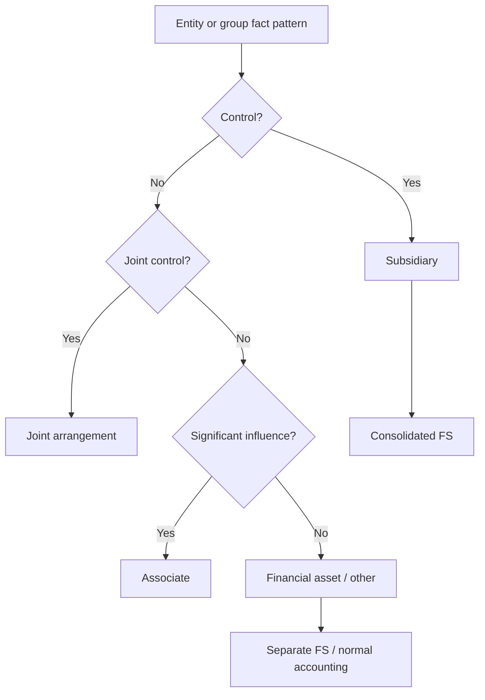

# Chapter 13, Unit 1: Introduction to Consolidated and Separate Financial Statements

## Exam Relevance

- This is the opening logic of the consolidation chapter.
- The examiner uses it to test whether you can tell a group from a single entity and then choose the right standard.
- The high-value points are why consolidated statements matter, how group reporting works, and where Ind AS 110, 111, 28, 27 and 112 fit together.

## Core Intuition

Consolidation starts from a simple idea: the parent and its subsidiaries are shown as one economic unit, even though they remain separate legal entities.

## Concept Map

## Key Concepts

### 1. Why Consolidated Financial Statements Matter

Consolidated financial statements present the financial position, performance, and cash flows of the parent and its subsidiaries as a single reporting entity.

This matters because users usually want the group picture, not just the legal shell of the parent company.

In exam language:

- separate FS show one entity,
- consolidated FS show the group.

### 2. Why Separate Financial Statements Exist

Separate financial statements are prepared for one reporting entity on its own.

They are useful when the question is about:

- the parent alone,
- an investor with joint control,
- an investor with significant influence,
- measurement choices for investments in subsidiaries, associates, or joint ventures in the investor's own books.

### 3. Standards in This Chapter

| Ind AS | Main role in this chapter |
|---|---|
| Ind AS 110 | Decides when control exists and therefore when consolidation is required |
| Ind AS 111 | Decides whether a joint arrangement is a joint operation or joint venture |
| Ind AS 28 | Covers significant influence and equity method for associates and joint ventures |
| Ind AS 27 | Covers separate financial statements |
| Ind AS 112 | Covers disclosures about interests in other entities |

### 4. Reporting Logic

The chapter follows a neat decision ladder:

1. Ask whether there is control.
2. If yes, consolidate as a subsidiary.
3. If not, ask whether there is joint control.
4. If yes, classify under joint arrangement.
5. If not, ask whether there is significant influence.
6. If yes, treat as associate.
7. If none of these, treat it as a normal financial instrument or other investment.

```mermaid
flowchart TD
    A[Investment / arrangement] --> B{Control?}
    B -->|Yes| C[Consolidate]
    B -->|No| D{Joint control?}
    D -->|Yes| E[Ind AS 111]
    D -->|No| F{Significant influence?}
    F -->|Yes| G[Ind AS 28]
    F -->|No| H[Ind AS 109 or other]
```

### 5. Group Reporting Mindset

A large corporate often creates several legal entities for tax, operating efficiency, regulatory reasons, or business restructuring.

That does not break the group into separate economic stories.

The examiner usually wants you to keep two levels in mind:

- legal entity level,
- group level.

The group level is the one that drives consolidation questions.

### 6. Control as the Pivot

The moment control exists, the reporting changes.

The parent cannot treat the subsidiary as an external investment only. It must present the subsidiary inside the consolidated group picture.

That is why Ind AS 110 is the foundation for the rest of the chapter.

## Professor's Problem-Solving Framework

1. Identify who the parent might be.
2. Ask whether the investor controls an entity.
3. If yes, think consolidated financial statements.
4. If no, test for joint control or significant influence.
5. Pick the standard before starting the accounting.

## Worked Examples

### Example 1: Parent and subsidiary

Problem:

P Ltd. owns 80% of S Ltd. and directs S Ltd.'s operating and financial policies.

Working:

- P Ltd. controls S Ltd.
- S Ltd. is a subsidiary.
- Group financial statements are required.

Answer:

Prepare consolidated financial statements for P Ltd. and S Ltd.

### Example 2: Separate financial statements

Problem:

A parent wants to present only its own financial position to a lender.

Working:

- This is a one-entity presentation.
- The parent is not presenting the group as a single economic unit.

Answer:

Those are separate financial statements, not consolidated financial statements.

## Common Mistakes

- Thinking consolidated FS are optional whenever subsidiaries exist.
- Mixing up group reporting with the parent's standalone books.
- Jumping to associate accounting before testing control.
- Treating joint control as the same thing as control.
- Forgetting that Ind AS 112 is about disclosures, not consolidation mechanics.

## Summary Tables

| Situation | Reporting route | Key idea |
|---|---|---|
| Control over investee | Consolidation under Ind AS 110 | Group as one entity |
| Joint control | Joint arrangement under Ind AS 111 | Shared control |
| Significant influence | Equity method under Ind AS 28 | Influence without control |
| No control / no influence | Financial asset or other investment | Ordinary investment accounting |
| Parent-only presentation | Separate financial statements under Ind AS 27 | One entity only |

## Last-Day Revision

- Consolidated FS = parent + subsidiaries as one reporting unit.
- Separate FS = one entity only.
- Control is the first gate.
- Ind AS 110 decides control.
- Ind AS 111 handles joint control.
- Ind AS 28 handles significant influence.
- Ind AS 27 handles separate FS.
- Ind AS 112 handles disclosures about interests in other entities.
- The exam often tests the standard choice before the numbers.

## Doubts / Version-Sensitive Items

- The source PDF uses concise chapter-flow terminology; keep the wording close if asked for a definition-style answer.
- The distinction between consolidated FS and combined FS should be checked against the exact course material if the examiner raises unusual group structures.
