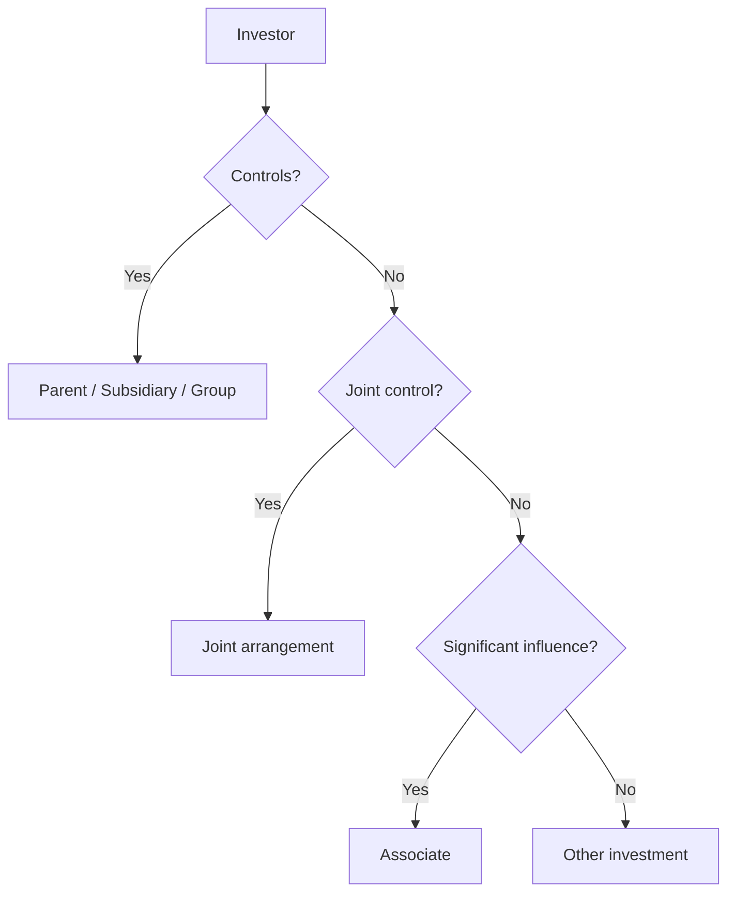
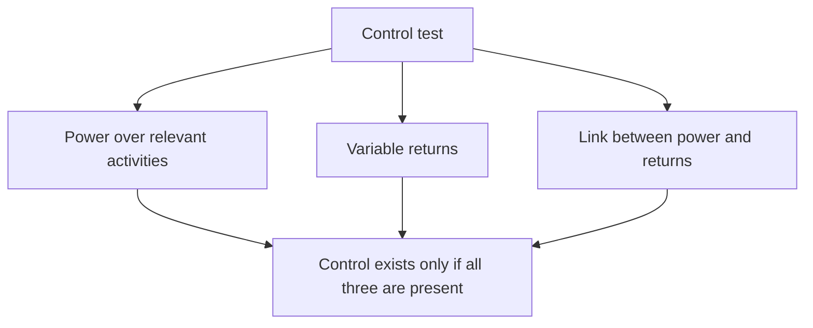
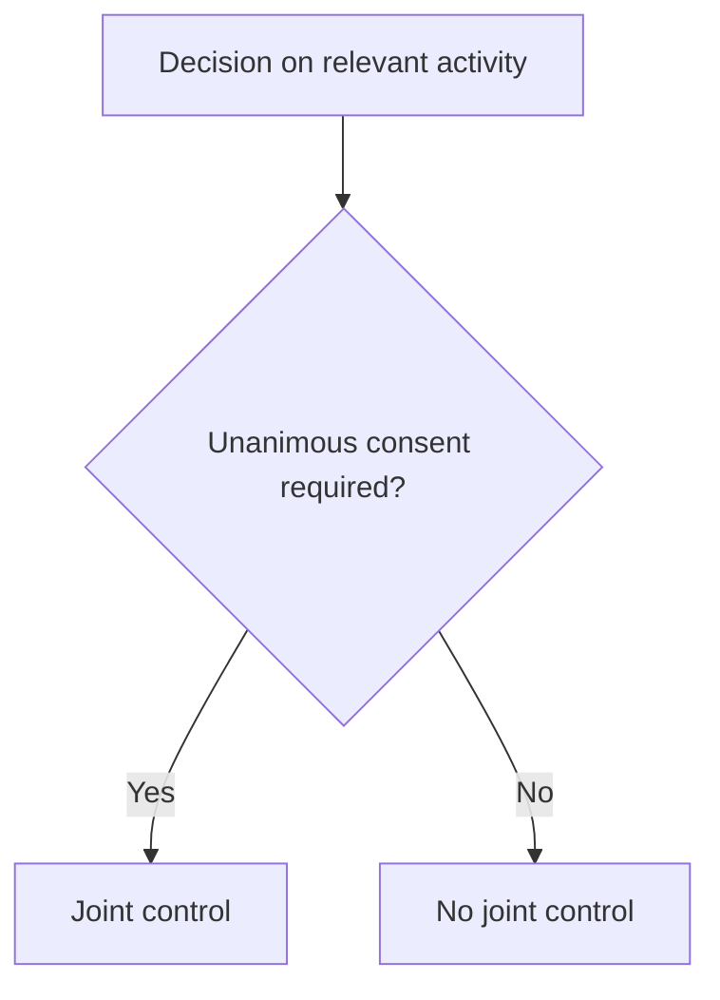

# Chapter 13, Unit 2: Important Definitions

## Exam Relevance

- This is a definition-heavy unit, but the definitions are the skeleton of the whole consolidation chapter.
- The examiner uses them to trap students into confusing control, joint control, significant influence, parent, subsidiary, NCI, group, and separate financial statements.
- Many questions are short but strict: one wrong relationship term changes the whole answer.

## Core Intuition

The whole chapter is really about classification: who controls whom, who shares control, and who only influences.

## Concept Map

## Key Concepts

### 1. Parent

A parent is an entity that controls one or more entities.

Once control exists, the parent sits at the top of a group relationship.

### 2. Subsidiary

A subsidiary is an entity controlled by another entity.

The same entity can be a subsidiary in one relationship and an investor in another.

### 3. Group

A group means a parent and its subsidiaries.

This is the reporting boundary used for consolidated financial statements.

### 4. Control over an Investee

Control exists when the investor:

- has power over the investee,
- is exposed, or has rights, to variable returns from its involvement,
- can use that power to affect those returns.

Exam trap:

- shareholding alone is not the only clue,
- vetoes, board rights, and contractual powers can matter,
- potential voting rights may matter if they are substantive.

### 5. Power

Power means existing rights that give the current ability to direct the relevant activities.

In exam terms, the question is not "who owns the paper?" but "who can direct what matters?"

### 6. Variable Returns

Variable returns are the returns the investor gets from involvement with the investee.

They can be positive, negative, or both.

Examples:

- dividends,
- cost savings,
- synergies,
- exposure to losses,
- residual interests.

### 7. Joint Arrangement and Joint Control

A joint arrangement is an arrangement in which two or more parties have joint control.

Joint control exists only when decisions about the relevant activities require unanimous consent of the parties sharing control.

The unanimous-consent feature is the exam trigger.

### 8. Joint Operation

A joint operation is a joint arrangement where the parties with joint control have rights to the assets and obligations for the liabilities relating to the arrangement.

This points to direct recognition of the relevant share of assets, liabilities, income, and expenses.

### 9. Joint Venture

A joint venture is a joint arrangement where the parties with joint control have rights to the net assets of the arrangement.

This points away from direct asset/liability recognition and toward equity-method logic in the group context.

### 10. Associate and Significant Influence

An associate is an entity over which the investor has significant influence.

Significant influence is the power to participate in financial and operating policy decisions, but not control or joint control of those policies.

Practical signs:

- board representation,
- participation in policy making,
- material transactions,
- interchange of managerial personnel,
- technical dependency.

### 11. Non-Controlling Interest

NCI is the equity in a subsidiary that is not attributable, directly or indirectly, to the parent.

In plain language, it is the outside share of the subsidiary's equity after consolidation.

### 12. Consolidated Financial Statements

Consolidated financial statements are the financial statements of a group in which the parent's and subsidiaries' assets, liabilities, equity, income, expenses, and cash flows are presented as those of a single economic entity.

This is the end-result of control-based reporting.

### 13. Separate Financial Statements

Separate financial statements are presented by a parent, or by an investor with joint control or significant influence, in which investments are accounted for at cost or in accordance with Ind AS 109, depending on the case.

The point is that separate FS do not collapse the investee into one combined reporting entity.

## Comparison Table

| Term | Core meaning | Exam clue |
|---|---|---|
| Parent | Controls one or more entities | Control is the trigger |
| Subsidiary | Controlled by another entity | Control flows downward |
| Group | Parent + subsidiaries | Consolidation boundary |
| Control | Power + variable returns + link | Full consolidation test |
| Joint control | Unanimous consent on relevant activities | Shared control only |
| Joint operation | Rights to assets and obligations for liabilities | Direct recognition |
| Joint venture | Rights to net assets | Equity-method style |
| Associate | Significant influence | Influence, not control |
| NCI | Equity not attributable to parent | Outside interest |
| Separate FS | One entity's statements | No group presentation |

## Professor's Problem-Solving Framework

1. Read the relationship fact pattern first.
2. Classify the link as control, joint control, significant influence, or none.
3. Use the classification to choose the standard.
4. State the conclusion in the standard's language.

## Worked Examples

### Example 1: 70% holding with control

Problem:

A company holds 70% of voting rights and can appoint the majority of directors.

Working:

- Power exists.
- Variable returns exist.
- The power affects returns.

Answer:

The company controls the investee. The investee is a subsidiary.

### Example 2: 50-50 arrangement with unanimous consent

Problem:

Two parties each own 50% and all relevant activity decisions need unanimous approval.

Working:

- Decisions require unanimous consent.
- No one can act alone.

Answer:

The arrangement is under joint control.

### Example 3: 30% with policy participation

Problem:

An investor owns 30% and has board representation, participates in budgets, and influences policy.

Working:

- No clear control.
- More than passive investment.
- Significant participation in policy decisions.

Answer:

The investee is likely an associate.

## Common Mistakes

- Treating any large shareholding as automatic control.
- Confusing joint control with joint operation.
- Forgetting that NCI is part of subsidiary equity, not a separate entity.
- Using the wrong test for associate versus subsidiary.
- Calling an arrangement a joint venture merely because there are two parties.

## Summary Tables

| If the fact says... | Likely answer |
|---|---|
| "Controls", "power", "can direct relevant activities" | Parent / subsidiary / control |
| "Unanimous consent" | Joint control |
| "Rights to assets and liabilities" | Joint operation |
| "Rights to net assets" | Joint venture |
| "Participate in policy decisions" | Associate / significant influence |
| "Equity not attributable to parent" | NCI |

## Last-Day Revision

- Parent controls one or more entities.
- Subsidiary is controlled by another entity.
- Group = parent + subsidiaries.
- Control = power + variable returns + link between them.
- Power = existing rights to direct relevant activities.
- Joint control = unanimous consent on relevant activities.
- Joint operation = rights to assets and obligations for liabilities.
- Joint venture = rights to net assets.
- Associate = significant influence.
- Separate FS are not group FS.

## Doubts / Version-Sensitive Items

- The source PDF keeps definitions short and exact; if the question asks for a legal-style definition, use source-aligned wording.
- Potential voting rights and substance-over-form control points are exam sensitive and should be checked against the full control chapter if the facts are tricky.
