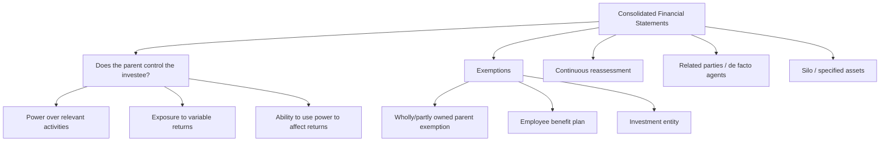

# Chapter 13, Unit 3: Consolidated Financial Statements

## Exam Relevance

- This unit is usually tested for the idea of control, not for mechanical consolidation entries.
- The examiner likes short theory questions on when a parent must consolidate, when it gets an exemption, and how control is judged.
- Mixed questions often ask whether an entity is a subsidiary, associate, joint venture, or just a financial asset.
- Control facts, de facto agency, potential voting rights, and investment entity status are common traps.

## Core Intuition

Consolidation starts only when one entity really controls another, and control is judged by power, variable returns, and the ability to use power to affect those returns.

## Concept Map

## Key Concepts

### 1. Control

Control is the gatekeeper for consolidation.

An investor controls an investee only if all three exist together:

- power over the investee
- exposure, or rights, to variable returns
- ability to use power to affect those returns

If one link is missing, consolidation usually fails.

### 2. Power

Power means existing rights that give current ability to direct relevant activities.

Relevant activities are the activities that significantly affect returns, such as:

- deciding budgets
- appointing or removing key management
- buying, selling, or financing key assets
- setting operating and capital policies

Power may come from voting rights, contractual rights, or a combination.

### 3. Variable returns

Variable returns include more than dividends.

They can be:

- dividends
- changes in the value of investment
- remuneration
- fee income
- cost savings
- access to residual assets

The key point is that returns can go up or down with the investee's performance.

### 4. Link between power and returns

The investor must be able to use its power to affect the amount of returns it gets.

That is why a passive investor with a large holding may still fail the control test, while a smaller holder with decisive rights may succeed.

### 5. De facto agents and related parties

When another person acts on behalf of an investor, that person may be a de facto agent.

The examiner may hide control through:

- family members
- entities acting together
- funding or appointment arrangements
- side agreements

So do not read ownership percentages in isolation.

### 6. Silo or deemed separate entity

A portion of an investee can sometimes be treated as a separate unit for control analysis.

This matters when rights over a ring-fenced asset pool or sub-fund are isolated from the rest of the entity.

### 7. Investment entity

An investment entity measures its subsidiaries at fair value through profit or loss instead of consolidating them.

Watch for the business-purpose test:

- capital appreciation
- investment income
- or both

The entity should also typically measure and monitor substantially all investments at fair value.

### 8. Continuous reassessment

Control is not a once-for-all label.

If facts change, the investor must reassess control.

Typical triggers:

- change in voting rights
- new contracts
- new restrictions
- changes in de facto arrangements
- expiry or exercise of options

## Professor's Problem-Solving Framework

1. Identify the investee and the parties around it.
2. Check whether the investor has current power over relevant activities.
3. Check whether the investor is exposed to variable returns.
4. Check whether the investor can use power to affect those returns.
5. Test exemptions and special cases.
6. State the final status: parent, subsidiary, associate, joint arrangement, financial asset, or investment entity exception.

## Worked Examples

### Example 1: Simple control test

Problem:

P Ltd. owns 55% of S Ltd. P appoints the majority of S's key management and approves S's operating budget.

Working:

- P has existing rights.
- P directs relevant activities through management appointments and budgets.
- P is exposed to variable returns through dividends and share value.
- P can use power to affect those returns.

Answer:

P controls S and must consolidate S, unless an exemption applies.

### Example 2: Smaller holding, stronger rights

Problem:

A Ltd. owns 30% of B Ltd., but a shareholder agreement gives A the right to direct budgets and key operating decisions.

Working:

- Percentage holding is not decisive.
- Contractual rights give current power.
- A expects returns from dividends and residual value.
- A can use the power to affect those returns.

Answer:

A may control B even with 30% ownership.

### Example 3: De facto agency trap

Problem:

Investor X owns 25% of Y Ltd. X's brother owns another 30% and votes consistently with X.

Working:

- The brother may be a de facto agent if acting on X's behalf.
- Combined rights may create control depending on the facts.

Answer:

Do not conclude from 25% alone. The relationship facts must be tested for de facto agency.

## Common Mistakes

- Treating high percentage ownership as automatic control.
- Ignoring contractual rights that override percentage holding.
- Forgetting that control needs all three elements together.
- Mixing control with significant influence or joint control.
- Missing the investment entity exception.
- Forgetting to reassess control when facts change.

## Summary Tables

| Item | Meaning | Exam reminder |
|---|---|---|
| Power | Current ability to direct relevant activities | Look for rights, not just ownership |
| Variable returns | Returns that change with performance | Dividends are only one part |
| Link | Ability to use power to affect returns | This is the control hinge |
| De facto agent | Someone acting on investor's behalf | Watch family and side arrangements |
| Silo | Deemed separate part of an investee | Useful in fund / ring-fenced structures |
| Investment entity | Measures most subsidiaries at FVPL | Exception to consolidation |

## Last-Day Revision

- Control = power + variable returns + link.
- Relevant activities are the activities that drive returns.
- Ownership percentage is only evidence, not the rule itself.
- Control can exist through contract, not only shares.
- Reassess control when rights or facts change.
- Investment entities do not consolidate most subsidiaries.
- Employee benefit plans are outside Ind AS 110 consolidation.
- Related parties can matter because they may act as de facto agents.
- Silo analysis can carve out a separately controlled part of an investee.

## Doubts / Version-Sensitive Items

- Check the exact edition wording for the investment entity indicators, because examiners sometimes use the current ICAI phrasing rather than a short textbook version.
- The title of Chapter 13 varies slightly between module editions, but the control logic stays the same.
- If a question uses old Indian GAAP exceptions such as temporary control or severe restrictions, do not apply them under Ind AS 110.

