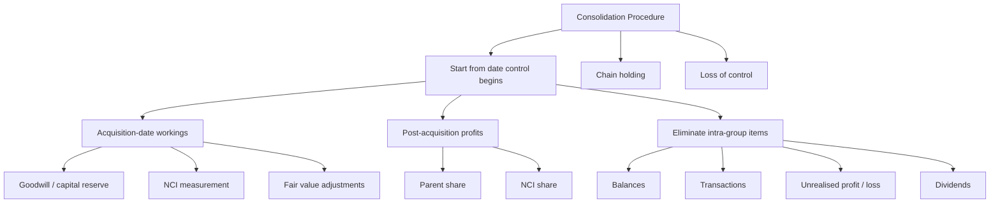

# Chapter 13, Unit 4: Ind AS 110 - Consolidation Procedure for Subsidiaries

## Exam Relevance

- This is the working-heavy consolidation unit.
- The examiner usually asks for acquisition-date goodwill or capital reserve, post-acquisition profits, NCI, and elimination entries.
- Common practical twists include step acquisition, fair value adjustments, dividends, unrealised profit, and intra-group balances.
- Chain holdings and loss of control are also high-value theory-practical hybrids.

## Core Intuition

Once control starts, the group is treated as one economic unit, so you combine assets and liabilities line by line and then eliminate what the group cannot owe itself, earn from itself, or sell to itself.

## Concept Map



## Key Concepts

### 1. Date of consolidation

Consolidation begins from the date control is obtained and stops when control is lost.

That date matters because:

- pre-acquisition reserves are not part of group post-acquisition profit
- acquisition-date fair values drive goodwill
- later profits are shared between parent and NCI

### 2. Acquisition-date workings

At acquisition, the group measures:

- consideration transferred
- NCI
- fair value of identifiable net assets
- goodwill or capital reserve

Two common NCI bases appear in exam questions:

- fair value method
- proportionate share method

Goodwill changes depending on the NCI method used.

### 3. Goodwill or capital reserve

Goodwill is a balancing figure when the total purchase package exceeds the fair value of net identifiable assets.

Capital reserve appears when net identifiable assets exceed the total deemed purchase price.

### 4. NCI

NCI is shown within equity separately from the parent's equity.

It represents the outside shareholders' share in net assets and post-acquisition results of the subsidiary.

### 5. Post-acquisition profits

Only profits arising after the acquisition date are shared in consolidation.

Pre-acquisition reserves are used for acquisition-date measurement, not for current-period group profit sharing.

### 6. Fair value adjustments

If a subsidiary's assets or liabilities were fair-valued at acquisition, the fair value uplift or reduction must be reflected in consolidation.

These adjustments affect:

- depreciation or amortisation
- post-acquisition profit
- goodwill calculation

### 7. Intra-group elimination

A group cannot report profit from transactions with itself.

So the following are eliminated:

- intercompany receivables and payables
- sales and purchases within the group
- interest, rent, and management charges within the group
- unrealised profit in closing inventory and non-current assets

### 8. Dividends

Dividends from subsidiary to parent are not group income in consolidation.

They reduce investment or retained earnings in the separate books, but they do not create outside profit for the group.

### 9. Chain holding

If a parent controls a subsidiary through another subsidiary, the whole chain must be considered.

The timing of acquisition across the chain matters for reserves and post-acquisition calculations.

### 10. Loss of control

If control is lost, consolidation stops.

The retained interest is remeasured where required, and the resulting gain or loss is recognised.

## Professor's Problem-Solving Framework

1. Fix the acquisition date and reporting date.
2. Split reserves into pre-acquisition and post-acquisition parts.
3. Compute goodwill or capital reserve and NCI on the acquisition date.
4. Adjust for fair value changes in subsidiary assets and liabilities.
5. Calculate parent share of post-acquisition profits.
6. Add NCI share of post-acquisition profits.
7. Eliminate intra-group balances, sales, profits, and dividends.
8. Present the consolidated balance sheet, P&L, cash flow, and notes cleanly.

## Worked Examples

### Example 1: Acquisition-date goodwill and NCI

Problem:

P Ltd. buys 80% of S Ltd. for 120 lakh. Fair value of NCI is 30 lakh. Fair value of net identifiable assets is 130 lakh.

Working:

```text
Consideration transferred = 120
NCI = 30
Total deemed purchase price = 150
Fair value of net identifiable assets = 130
Goodwill = 20
```

Answer:

Recognise goodwill of 20 lakh and NCI of 30 lakh at acquisition.

### Example 2: Step acquisition

Problem:

P Ltd. held 25% of S Ltd. It buys another 40% and gets control.

Working:

- Remeasure the previously held 25% interest at acquisition-date fair value.
- Recognise any resulting gain or loss in profit or loss or OCI, depending on the asset classification.
- Use the acquisition-date fair values for the new control calculation.

Answer:

This is a business combination achieved in stages. The old holding is remeasured, then goodwill and NCI are computed on the control date.

### Example 3: Parent share of post-acquisition profit

Problem:

P owns 70% of S. S earns 100 lakh after acquisition.

Working:

```text
Parent share = 100 x 70% = 70
NCI share = 100 x 30% = 30
```

Answer:

Consolidated profit is split 70 lakh to parent and 30 lakh to NCI, subject to further eliminations or fair value depreciation adjustments.

### Example 4: Intra-group inventory profit

Problem:

P sells goods to S for 10 lakh and makes 2 lakh profit. Closing stock with S includes the goods.

Working:

- The 2 lakh unrealised profit is eliminated in full.
- The group inventory is reduced to cost.
- The eliminated profit is allocated between parent and NCI according to ownership ratio in the profit-sharing layer.

Answer:

Eliminate unrealised profit from group profit and closing inventory.

### Example 5: Dividend trap

Problem:

S declares dividend to P during the year.

Working:

- Dividend is not group income.
- It is an intra-group distribution.
- It should not inflate consolidated profit.

Answer:

Remove the dividend effect in consolidation; only outside income remains.

## Common Mistakes

- Using the subsidiary's full year profit without cutting off pre-acquisition profit.
- Forgetting to remeasure previously held interest in step acquisition.
- Confusing acquisition-date NCI with closing-date NCI.
- Leaving intercompany sales in consolidated revenue or purchases.
- Eliminating only the unrealised profit belonging to the parent when the full profit must be removed from group inventory or asset carrying value.
- Forgetting extra depreciation on fair value uplifts.
- Treating dividends from subsidiary as group income.

## Summary Tables

| Item | Consolidation treatment | Exam reminder |
|---|---|---|
| Share capital of subsidiary | Eliminate against parent investment | Group is one unit |
| Goodwill | Recognise at acquisition date | Depends on NCI method |
| NCI | Show in equity | Includes share in post-acquisition movement |
| Post-acquisition profit | Split between parent and NCI | Pre-acquisition reserves are separate |
| Intra-group balances | Eliminate fully | Receivable and payable cannot both stay |
| Intra-group sales | Eliminate revenue and purchase | No group profit on self-dealing |
| Unrealised inventory profit | Eliminate fully | Closing stock at group cost |
| Fair value uplift | Adjust depreciation / amortisation | Affects future profits |
| Dividend from sub | Eliminate as intra-group flow | Not group income |

## Last-Day Revision

- Consolidation begins when control begins.
- Acquisition-date working is the foundation: consideration, NCI, net assets, goodwill.
- Goodwill changes with the NCI measurement basis.
- Only post-acquisition profits belong to current group performance.
- Fair value adjustments change later depreciation and profit.
- Intra-group balances and transactions are eliminated in full.
- Unrealised profit on inventory and non-current assets must be removed.
- Dividends from a subsidiary do not create consolidated income.
- Chain holdings require you to track who controlled what and when.
- Loss of control ends consolidation and may trigger gain or loss recognition.

## Doubts / Version-Sensitive Items

- Consolidation workings are order-sensitive: identify acquisition date, measure consideration/NCI/net assets, compute goodwill or bargain purchase, then process post-acquisition movements.
- Intra-group profit elimination depends on whether inventory/PPE remains within the group at reporting date. Do not eliminate profit already realized outside the group.
- NCI measurement choice affects goodwill. Keep the question's specified method visible in the working.
- Check whether the question wants the fair value method or the proportionate share method for NCI; the answer changes goodwill and NCI.
- If the question says only one-year figures, be careful about the acquisition date before splitting reserves.
- For chain holding, the order of acquisition can change which reserves are pre-acquisition.
- Where the source question uses specific group tables or line-item formats, match the format expected by ICAI instead of rewriting the whole statement in prose.
