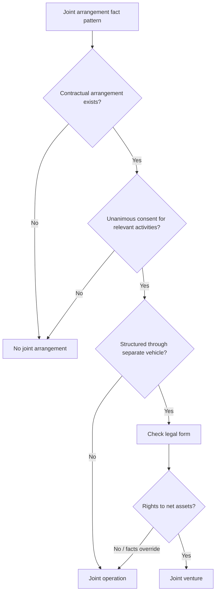
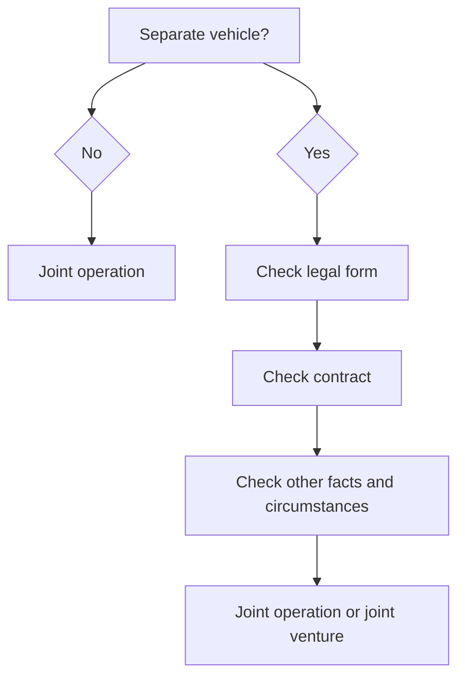

# Chapter 13, Unit 5: Ind AS 111 Joint Arrangements

## Exam Relevance

- This unit is a classification-and-accounting favourite.
- The examiner mainly tests whether the fact pattern is a joint operation or a joint venture.
- The highest-value traps are:
  - unanimous consent vs simple majority,
  - rights to assets and obligations for liabilities vs rights to net assets,
  - separate vehicle vs no separate vehicle,
  - legal form vs contractual terms vs other facts and circumstances.
- The question may ask for the accounting of a party to the arrangement, not just the classification.

## Core Intuition

Joint arrangement questions are really about this one test: who has the rights and who bears the obligations?

## Concept Map

## Key Concepts

### 1. What Ind AS 111 is trying to do

Ind AS 111 tells an entity how to classify a joint arrangement and how to account for it.

The standard starts with control sharing, then asks whether the arrangement is:

- a joint operation, or
- a joint venture.

That classification drives the accounting.

### 2. Joint arrangement and joint control

A joint arrangement exists when two or more parties have joint control.

Joint control means:

- the parties are bound by a contractual arrangement, and
- decisions about the relevant activities require unanimous consent of the parties sharing control.

If one party can decide the relevant activities alone, there is no joint control.

### 3. The real classification test

Once joint control exists, the next question is:

- rights to assets and obligations for liabilities = joint operation
- rights to net assets = joint venture

The presence of a separate legal vehicle does not end the inquiry. It only starts it.

### 4. Separate vehicle matters, but not alone

If the arrangement is not structured through a separate vehicle, it is a joint operation.

If the arrangement is structured through a separate vehicle, look at:

1. legal form,
2. contractual terms,
3. other facts and circumstances, where relevant.

### 5. When legal form points to a joint venture

If the legal form of the separate vehicle creates a distinct entity in its own right, the default conclusion is often a joint venture.

But that is not the end if the contractual terms or the surrounding facts show that the parties really have:

- rights to the assets, and
- obligations for the liabilities.

### 6. When legal form points to a joint operation

If the legal form does not separate the parties from the vehicle, the arrangement is treated as a joint operation and there is no need to go further.

This is why partnership-like forms are exam-sensitive. The legal form can drive the answer.

### 7. Joint operation accounting by a joint operator

A joint operator recognises, in relation to its interest in the joint operation:

- its assets, including its share of any assets held jointly,
- its liabilities, including its share of any liabilities incurred jointly,
- its revenue from the sale of its share of the output,
- its share of the revenue from the sale of the output by the joint operation,
- its expenses, including its share of any expenses incurred jointly.

In exam language, a joint operation is treated more like direct ownership of the underlying items than like a passive investment.

### 8. Joint venture accounting link

A joint venture is not consolidated line by line.

The parties with joint control are joint venturers, and the accounting in consolidated financial statements moves to Ind AS 28 equity-method logic.

### 9. Why guarantees do not decide the classification

A guarantee to third parties does not by itself make a joint operation.

The key issue remains whether the parties have obligations for the liabilities relating to the arrangement, not whether they merely support the arrangement by guarantee.

### 10. Other facts and circumstances

Even where legal form and contract initially point to a joint venture, the surrounding facts may still show a joint operation.

Classic examiner clue:

- if the parties take substantially all output and fund the liabilities in substance, the arrangement may behave like a joint operation even though it sits inside a separate vehicle.

## Professor's Problem-Solving Framework

1. Check whether there is a contractual arrangement and unanimous consent.
2. Confirm whether joint control exists.
3. Ask whether the arrangement is structured through a separate vehicle.
4. Read the legal form, then the contract, then the real-world facts.
5. Conclude joint operation or joint venture.
6. If it is a joint operation, account for assets, liabilities, income and expenses directly.
7. If it is a joint venture, move to Ind AS 28.

## Worked Examples

### Example 1: 50-50 unanimous consent

Problem:

Two entities each hold 50% of the voting rights in an arrangement. All decisions about relevant activities require unanimous consent.

Working:

- contractual arrangement exists,
- relevant decisions need unanimous consent,
- neither party can act alone.

Answer:

The arrangement is under joint control.

### Example 2: LLP versus partnership firm

Problem:

Two parties form an LLP and share profits equally. Would the answer change if the same business were organised as a partnership firm?

Working:

- an LLP is a separate legal body, so the legal form points to rights in net assets,
- a partnership firm does not create the same separation between partners and firm.

Answer:

The LLP points to a joint venture, while a partnership firm can point to a joint operation if the legal form does not separate the parties from the assets and liabilities.

### Example 3: Shared output, shared liabilities

Problem:

The parties use a vehicle to produce output for themselves, take substantially all output, and fund the liabilities.

Working:

- the separate vehicle is not just a shell,
- but the parties consume the output and bear the funding burden in substance.

Answer:

The arrangement can be a joint operation despite the separate vehicle.

## Common Mistakes

- Treating a separate vehicle as automatically a joint venture.
- Forgetting that unanimous consent is the trigger for joint control.
- Jumping to accounting before classifying the arrangement.
- Using guarantees as the deciding factor instead of rights and obligations.
- Mixing up joint operation accounting with equity method accounting.

## Summary Tables

| Point | Joint operation | Joint venture |
|---|---|---|
| Core rights | Rights to assets and obligations for liabilities | Rights to net assets |
| Typical accounting | Direct recognition of share of assets, liabilities, income, expenses | Equity method under Ind AS 28 |
| Separate vehicle | May exist, but not decisive | Often points here, if legal form and facts support it |
| Examiner trigger | "Owns/uses assets and bears liabilities" | "Shares net assets" |

| Fact clue | Likely outcome |
|---|---|
| Unanimous consent on relevant activities | Joint control |
| No separate vehicle | Joint operation |
| LLP or company with net-asset rights | Joint venture likely |
| Partnership-style no separation | Joint operation likely |
| Guarantee only | Not decisive |

## Last-Day Revision

- Joint arrangement = two or more parties with joint control.
- Joint control = unanimous consent for relevant activities.
- No separate vehicle usually means joint operation.
- Separate vehicle requires legal form, contract and sometimes other facts.
- Joint operation = rights to assets and obligations for liabilities.
- Joint venture = rights to net assets.
- Joint operators recognise underlying assets, liabilities, income and expenses.
- Joint venturers use equity method under Ind AS 28.
- Guarantees do not by themselves decide classification.

## Doubts / Version-Sensitive Items

- Keep the wording of the legal-form test close to the source if the question asks for a definition-style answer.
- If the fact pattern uses partnership, LLP or another statutory vehicle, check the exact legal effect before concluding.
- If the arrangement has changed in substance after formation, reassess the classification.

