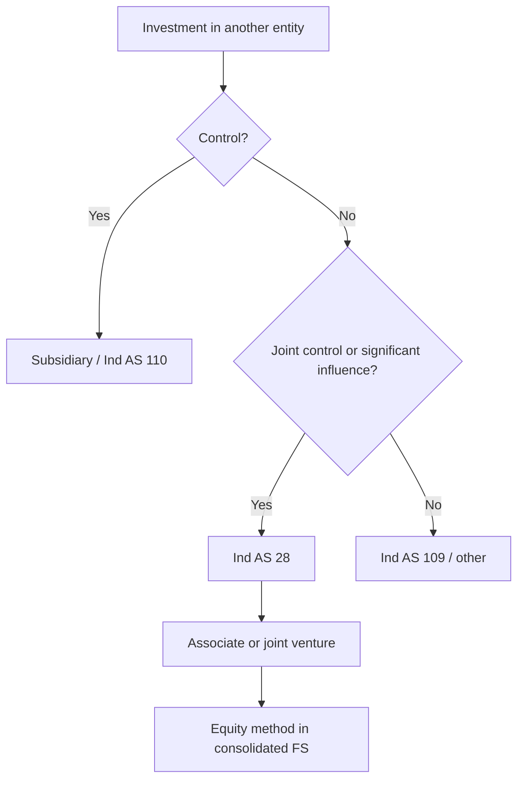
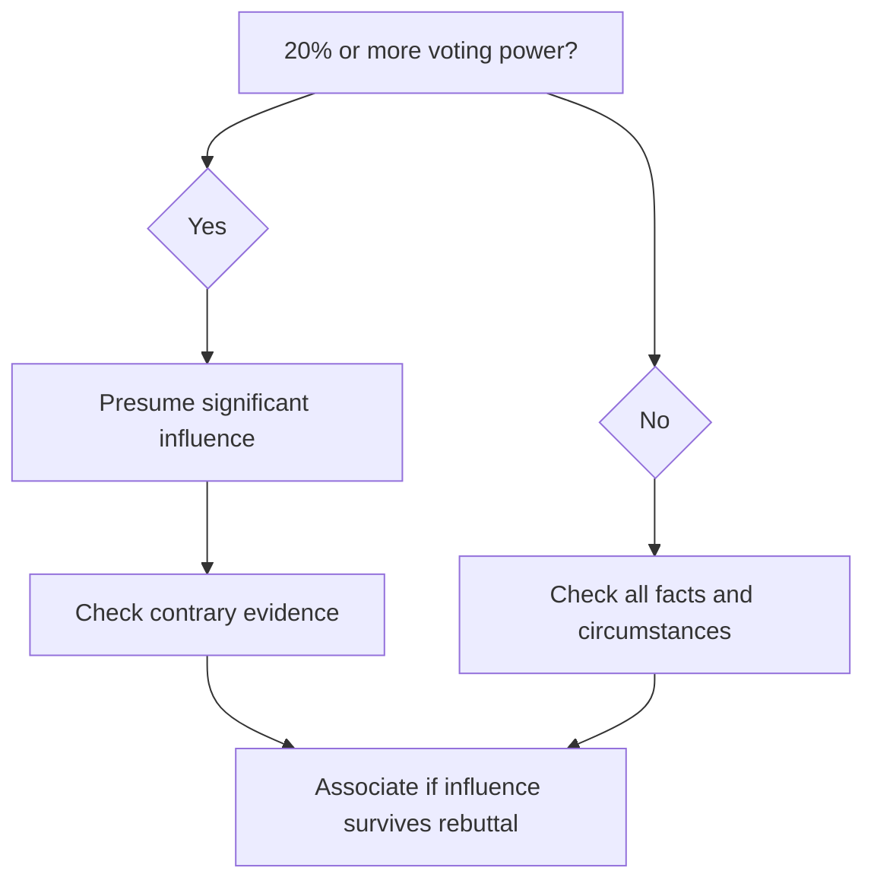

# Chapter 13, Unit 6: Ind AS 28 Investments in Associates and Joint Ventures

## Exam Relevance

- This unit is the equity-method core of the chapter.
- The examiner usually tests:
  - whether significant influence exists,
  - whether equity method applies,
  - how goodwill or capital reserve is picked up,
  - how profits, OCI, upstream/downstream profits, and losses are adjusted.
- Joint ventures and associates are both handled through the same equity-method family in consolidated financial statements.

## Core Intuition

An associate or joint venture is not consolidated line by line, but the investor still tracks its economic share through the equity method.

## Concept Map

## Key Concepts

### 1. Objective and scope

Ind AS 28 gives guidance for accounting for investments in:

- associates, and
- joint ventures.

It applies to investors with:

- significant influence, or
- joint control.

### 2. Significant influence

An associate is an entity over which the investor has significant influence.

Significant influence means the power to participate in the financial and operating policy decisions of the investee, but not control or joint control of those policies.

This is a judgment-heavy test.

### 3. Useful signs of significant influence

The standard looks at facts such as:

- board representation,
- participation in policy-making,
- material transactions between investor and investee,
- interchange of managerial personnel,
- provision of essential technical information,
- potential voting rights that are currently exercisable.

The usual presumption is that 20% or more of the voting power suggests significant influence, but that presumption can be rebutted by facts.

### 4. Potential voting rights

Potential voting rights that are currently exercisable are considered when assessing significant influence.

Rights that are not currently exercisable are ignored for this test.

Exam trap:

- current exercisability matters,
- mere future possibility is not enough.

### 5. Equity method starts from the date influence begins

The equity method begins when the investee becomes an associate or joint venture.

The investment is initially recorded at cost.

Then the carrying amount is adjusted for:

- the investor's share of post-acquisition profit or loss,
- the investor's share of other comprehensive income,
- distributions received,
- fair value adjustments and basis differences,
- impairment and long-term interest effects where relevant.

### 6. Goodwill and capital reserve

On acquisition, compare:

- cost of investment, and
- investor's share of the net fair value of the investee's identifiable assets and liabilities.

If cost is higher, the difference is goodwill.

If the share of net fair value is higher, the difference is capital reserve.

Goodwill is included in the carrying amount of the investment and is not amortised.

### 7. Share of profit or loss and OCI

The investor recognises its share of the associate's or joint venture's profit or loss in profit or loss.

The investor also recognises its share of the investee's other comprehensive income in OCI.

Where fair value adjustments existed at acquisition, the investor adjusts post-acquisition profits for those differences, such as:

- extra depreciation on stepped-up assets,
- impairment on goodwill or PPE.

### 8. Upstream and downstream transactions

Upstream and downstream profits are not always fully retained in the investor's books.

- Upstream: investee sells to investor.
- Downstream: investor sells to investee.

Unrealised profits or losses are eliminated only to the extent of the unrelated investors' interests.

If the transaction shows a reduction in NRV or impairment, the relevant losses may need full recognition depending on direction.

### 9. Different reporting periods

The reporting period difference between investor and investee cannot exceed 3 months.

If the dates differ, the investee's statements should be adjusted for material transactions or events between the two dates.

This is a frequent theory question because it is easy to write the limit incorrectly.

### 10. Uniform accounting policies

The investor and investee should use uniform accounting policies for like transactions and events in similar circumstances.

If not, adjustments are made for equity-method purposes.

### 11. Long-term interests

Some items in substance form part of the net investment in the associate or joint venture, such as:

- preference shares,
- long-term loans or receivables,
- other long-term interests where settlement is not planned or likely in the foreseeable future.

These are first accounted for under Ind AS 109, and then the remaining balance is considered under Ind AS 28.

### 12. Loss-making associate or joint venture

If the investor's share of losses equals or exceeds its interest, it stops recognising further losses, unless it has legal or constructive obligations or has made payments on behalf of the investee.

Losses are applied in reverse order of seniority:

- ordinary equity first,
- then long-term interests,
- then other interests that form part of the net investment.

### 13. Equity-method exemptions

The main exemptions are:

- a parent that is exempt from preparing consolidated financial statements and also meets the other conditions in Ind AS 28,
- venture capital organisations, mutual funds, unit trusts and similar entities may elect fair value through profit or loss for certain investments,
- portions of investments held through those entities can be measured at FVTPL while the rest is equity accounted.

## Professor's Problem-Solving Framework

1. Ask whether the investor controls the investee.
2. If not, test for joint control or significant influence.
3. If significant influence exists, classify as associate.
4. If joint control exists, classify as joint venture for Ind AS 28 purposes.
5. Apply the equity method from the date the status begins.
6. Adjust for goodwill or capital reserve.
7. Add share of profit or loss, OCI and other adjustments.
8. Check upstream/downstream eliminations, long-term interests and loss limits.

## Worked Examples

### Example 1: 25% holding with fair value step-up

Problem:

Blue Ltd. buys 25% of Green Ltd. for Rs. 1,25,000. Green's identifiable net assets have a fair value above carrying amount because of a building with a remaining life of 20 years.

Working:

- 25% suggests possible significant influence.
- Cost exceeds share of fair value net assets, so goodwill arises.
- Post-acquisition profit and OCI are picked up by share.
- Depreciation on the fair value step-up reduces the share of profit.

Answer:

Use the equity method, include goodwill in the investment, and adjust the investor's share of profit for the depreciation difference.

### Example 2: Upstream inventory sale

Problem:

A joint venture sells inventory to its investor and part of the inventory remains unsold at year-end.

Working:

- unrealised profit is embedded in closing inventory,
- only the investor's share of that profit is eliminated,
- the rest is treated as realised from the group perspective.

Answer:

Eliminate the unrealised profit only to the extent required by the investor's share and reverse it when the inventory is sold outside the group.

### Example 3: Long-term loan to a loss-making associate

Problem:

An investor has an ordinary share interest and a long-term loan to an associate that keeps making losses.

Working:

- ordinary interest can be reduced to zero first,
- long-term interests are then considered,
- further losses stop unless there is a legal or constructive obligation.

Answer:

Apply the loss allocation order and recognise any further loss only if the standard permits it.

## Common Mistakes

- Treating 20% as an automatic rule instead of a rebuttable presumption.
- Forgetting that currently exercisable potential voting rights matter.
- Leaving goodwill outside the carrying amount of the investment.
- Recognising all upstream/downstream profit without the unrealised-profit adjustment.
- Ignoring the 3-month reporting-period cap.
- Forgetting that long-term interests are first handled under Ind AS 109.

## Summary Tables

| Topic | Rule | Exam reminder |
|---|---|---|
| Significant influence | Power to participate in policy decisions, not control | Board rights and policy access matter |
| Presumption | 20% or more voting power | Rebuttable presumption |
| Equity method start | From date associate / JV status begins | Not before, not after |
| Goodwill / capital reserve | Cost vs share of net fair value | Goodwill stays in investment carrying amount |
| Reporting period gap | Max 3 months | Adjust intervening events |
| Long-term interests | Ind AS 109 first, then Ind AS 28 | Think net investment, not just shares |
| Loss limit | Stop at zero unless obligation exists | Reverse seniority matters |

| Transaction | Equity-method treatment |
|---|---|
| Upstream sale | Eliminate investor's share of unrealised profit |
| Downstream sale | Eliminate unrealised profit to extent of unrelated investors' interests |
| OCI movement | Investor's share goes to OCI |
| Dividend from investee | Reduces carrying amount, not profit share |

## Last-Day Revision

- Associate = significant influence.
- Significant influence = participation in financial and operating policy decisions, not control.
- 20% voting power is a rebuttable presumption.
- Currently exercisable potential voting rights count.
- Equity method starts when influence begins.
- Goodwill or capital reserve is recorded on acquisition.
- Share of profit, loss and OCI is recognised after acquisition.
- Upstream/downstream unrealised profits are not blindly left in the books.
- Reporting date difference cannot exceed 3 months.
- Long-term interests are handled under Ind AS 109 first.
- Losses stop when the net investment is exhausted unless obligations remain.

## Doubts / Version-Sensitive Items

- Confirm the exact exam wording if the question mixes associate, joint venture and joint control in one paragraph.
- If the reporting-period gap is near 3 months, check whether the question assumes a permitted adjustment.
- If the fact pattern uses convertible instruments, check whether they are currently exercisable or only future rights.
- In long-term interest questions, read the liquidation priority carefully before allocating losses.

