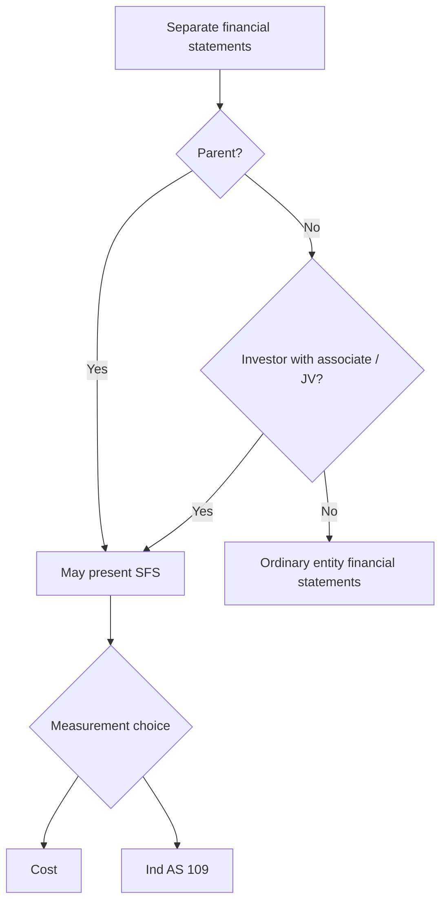
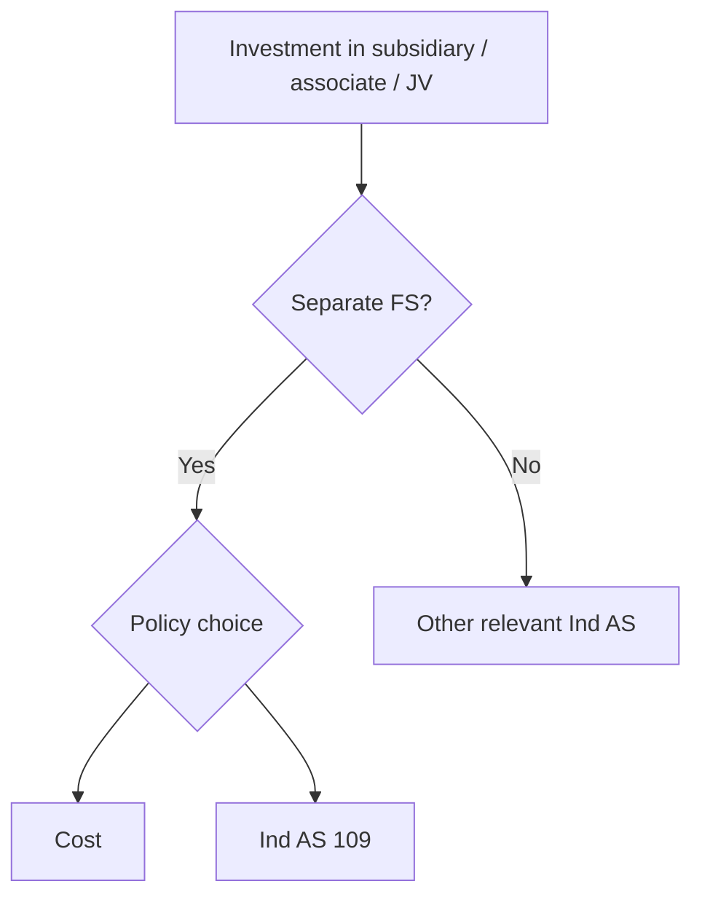

# Chapter 13, Unit 7: Ind AS 27 Separate Financial Statements

## Exam Relevance

- This unit is all about measurement choices in the investor's own books.
- The examiner usually tests:
  - what counts as separate financial statements,
  - whether the investment is measured at cost or under Ind AS 109,
  - when an investment entity measures subsidiaries at fair value,
  - what happens when a parent becomes or ceases to be an investment entity,
  - how dividends and group reorganisations are handled.

## Core Intuition

Separate financial statements do not show the group as one economic unit; they show the reporting entity on its own, with selected investments measured under the allowed model.

## Concept Map

## Key Concepts

### 1. What separate financial statements are

Separate financial statements are presented by:

- a parent, or
- an investor with an associate or joint venture.

In those statements, investments in subsidiaries, associates and joint ventures are measured at:

- cost, or
- in accordance with Ind AS 109.

### 2. Scope and practical meaning

Ind AS 27 applies when an entity elects, or is required by law, to present separate financial statements.

The standard does not force every entity to present separate financial statements. It tells you how to account for them when they exist.

### 3. Measurement choice for investments

An entity preparing separate financial statements shall account for investments in subsidiaries, associates and joint ventures using one accounting policy for each category:

- at cost, or
- in accordance with Ind AS 109.

The same approach must be applied consistently within a category.

### 4. Held-for-sale treatment

If an investment accounted for at cost is classified as held for sale, Ind AS 105 applies.

If the investment is measured under Ind AS 109, the measurement basis does not change merely because it is held for sale.

That is a neat exam trap.

### 5. Investment entity parent

An investment entity measures its subsidiaries at fair value through profit or loss under Ind AS 109.

In its separate financial statements, it keeps the same fair value through profit or loss approach.

### 6. Venture capital and similar elections

For associates and joint ventures held by, or indirectly through, venture capital organisations, mutual funds, unit trusts and similar entities, Ind AS 28 permits a fair value through profit or loss election.

If that election is made, the same treatment follows in separate financial statements.

### 7. When a parent ceases to be, or becomes, an investment entity

If a parent ceases to be an investment entity:

- it can measure the subsidiary at cost, using the fair value on the change date as deemed cost, or
- continue under Ind AS 109, depending on the structure of the standard and the election path.

If a parent becomes an investment entity:

- the subsidiary is measured at fair value through profit or loss,
- the gain or loss on remeasurement goes to profit or loss,
- OCI balances related to that subsidiary are reclassified as if the subsidiary had been disposed of on the change date.

### 8. Dividends

A dividend from a subsidiary, associate or joint venture is recognised in profit or loss in separate financial statements when the right to receive the dividend is established.

Usually that happens when the dividend is approved by shareholders.

### 9. Group reorganisation

If a parent reorganises its group by establishing a new parent, the new parent may measure its investment at cost based on the carrying amount of its share of the equity items shown in the original parent's separate financial statements, provided the conditions are met.

The key conditions are:

- the new parent obtains control of the original parent in exchange for equity instruments,
- the assets and liabilities of the new and original groups are the same immediately before and after,
- the owners keep the same absolute and relative interests.

### 10. Disclosures in separate financial statements

The separate FS disclosures are handled in Unit 8, but the accounting unit still matters for the classification of the statements.

The exam often tests whether a set of statements is:

- consolidated,
- separate, or
- just ordinary company financial statements without subsidiary / associate / JV exposure.

## Professor's Problem-Solving Framework

1. Decide whether the statements are separate financial statements.
2. Identify whether the entity is a parent, an associate investor, or a joint venture investor.
3. Pick the measurement choice: cost or Ind AS 109.
4. Check whether the entity is an investment entity or similar electing entity.
5. Apply held-for-sale and status-change rules if the facts mention them.
6. Recognise dividends when the right to receive them is established.
7. For reorganisations, test the exact three conditions before using carrying amount of equity items.

## Worked Examples

### Example 1: Cost or Ind AS 109

Problem:

A parent prepares separate financial statements and owns subsidiaries, an associate and a joint venture.

Working:

- separate FS are allowed,
- each category of investment must follow the chosen policy consistently,
- cost or Ind AS 109 is permitted.

Answer:

The investments are measured at either cost or in accordance with Ind AS 109, category-wise and consistently.

### Example 2: Dividend from associate

Problem:

An associate declares dividend on 31 March and the shareholder approval happens on 15 April.

Working:

- right to receive is not established until approval.

Answer:

Recognise the dividend in profit or loss in the period when the right to receive becomes established.

### Example 3: Parent becomes an investment entity

Problem:

A parent measured a subsidiary at cost. It now becomes an investment entity.

Working:

- the subsidiary is remeasured at fair value through profit or loss,
- the gain or loss is recognised in profit or loss,
- any prior OCI balance linked to the investment is reclassified appropriately.

Answer:

Switch to fair value through profit or loss from the date of change in status.

## Common Mistakes

- Thinking separate financial statements mean the same thing as consolidated financial statements.
- Forgetting that the measurement policy must be applied consistently within a category.
- Assuming held-for-sale automatically changes an Ind AS 109 investment measurement basis.
- Missing the dividend recognition trigger.
- Applying the group reorganisation cost rule without testing all three conditions.

## Summary Tables

| Topic | Rule | Exam reminder |
|---|---|---|
| Separate FS definition | Presented by parent or investor with JV / associate | One entity view |
| Measurement options | Cost or Ind AS 109 | Same policy within category |
| Held for sale | Cost investments follow Ind AS 105 | Ind AS 109 stays measured as such |
| Investment entity | Subsidiaries at FVTPL | Same in separate FS |
| Dividend | Recognise when right to receive is established | Usually approval date |
| Group reorganisation | Cost may be carrying amount of equity items | Only if conditions are met |

| Fact pattern | Likely accounting answer |
|---|---|
| Parent with subsidiaries | Separate FS can exist alongside consolidated FS |
| Associate / JV investor | Separate FS allowed; cost or Ind AS 109 |
| Entity becomes investment entity | Reclassify to FVTPL |
| Entity ceases to be investment entity | Use deemed cost or continue per rule path |

## Last-Day Revision

- Separate FS are not group FS.
- A parent or investor with JV / associate may present them.
- Investments in subsidiaries, associates and JVs are measured at cost or under Ind AS 109.
- Apply the same policy consistently for a category.
- Cost investments follow held-for-sale rules under Ind AS 105.
- Investment entity parents keep subsidiary investments at FVTPL.
- Dividends are recognised when the right to receive is established.
- Group reorganisation has a special cost rule if the conditions are satisfied.

## Doubts / Version-Sensitive Items

- Separate financial statements are not the same as consolidated financial statements. Do not import equity-method or consolidation workings unless the standard specifically requires or permits the measurement basis.
- The permitted measurement choices for investments in subsidiaries, associates, and joint ventures should be matched to the current source wording.
- Transition or change in measurement basis can be source-sensitive; if the question gives first-time adoption facts, cross-check Ind AS 101.
- Check the exact corporate-law requirement if the question asks whether separate financial statements are optional or mandatory.
- If a question uses the phrase "only financial statements", read it carefully against the investment entity and exemption rules.
- If the reorganisation facts are only partly given, do not assume the special cost rule applies.

