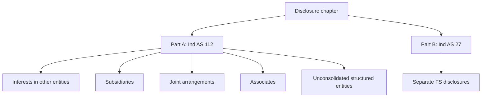
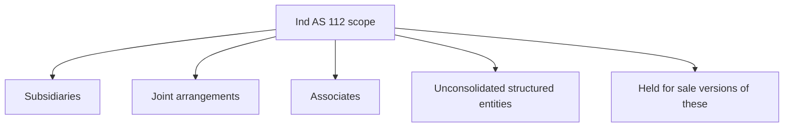
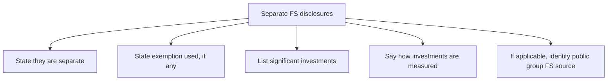

# Chapter 13, Unit 8: Disclosures

## Exam Relevance

- This unit is disclosure-heavy and often reads like a checklist question.
- The examiner usually tests whether you can separate:
  - Ind AS 112 disclosures for interests in other entities, and
  - Ind AS 27 disclosures in separate financial statements.
- The key is not memorising every line. It is knowing the objective, scope, and the major disclosure buckets.

## Core Intuition

The disclosure standards answer two exam questions:

1. What do outsiders need to know about the group risks and relationships?
2. What do they need to know when the entity presents separate financial statements?

## Concept Map

## Key Concepts

### 1. Objective of Ind AS 112

Ind AS 112 requires disclosure of information about interests in other entities so that users can evaluate:

- the nature of those interests,
- the risks associated with them,
- the effects on financial position, performance and cash flows.

The disclosure lens is broader than mere ownership. It captures contractual and non-contractual involvement that exposes the entity to variability of returns.

### 2. What counts as an interest in another entity

An interest in another entity can arise from:

- equity or debt instruments,
- funding support,
- liquidity support,
- credit enhancement,
- guarantees,
- control, joint control or significant influence.

A routine customer-supplier relationship alone is not enough.

### 3. Scope of Ind AS 112

Ind AS 112 applies when an entity has an interest in:

- subsidiaries,
- joint arrangements,
- associates,
- unconsolidated structured entities.

It also applies if those interests are classified as held for sale or included in a disposal group classified as held for sale.

### 4. Main exclusions

Ind AS 112 does not apply to:

- post-employment benefit plans and similar employee benefit plans under Ind AS 19,
- separate financial statements to which Ind AS 27 applies.

Important caveat:

- if an entity has interests in unconsolidated structured entities and prepares separate financial statements as its only financial statements, the Ind AS 112 disclosures still matter.
- an investment entity that presents only separate financial statements still gives the investment-entity disclosures required by Ind AS 112.

### 5. Subsidiary disclosures

For each subsidiary with material non-controlling interests, disclose:

- name,
- principal place of business and country of incorporation if different,
- ownership interest held by NCI,
- voting rights held by NCI if different,
- profit or loss allocated to NCI,
- accumulated NCI at period end,
- summarised financial information.

Also disclose information that helps users evaluate:

- composition of the group,
- NCI interests in the group's activities and cash flows,
- significant restrictions on the parent's access to assets or settlement of liabilities,
- changes in ownership interests that do not result in loss of control,
- loss of control during the reporting period,
- risks associated with consolidated structured entities.

### 6. What "significant restrictions" means in practice

The standard wants the user to see where cash or assets are trapped.

Typical examples:

- legal or contractual barriers to transfer funds,
- dividend restrictions,
- loan repayment restrictions,
- approval rights held by non-controlling interests,
- statutory or regulatory blocks.

### 7. Structured entity disclosures

Where the entity is exposed to a consolidated structured entity, disclose:

- the terms of contractual arrangements requiring or potentially requiring support,
- the type and amount of support provided,
- the reasons for providing support,
- circumstances that expose the reporting entity to loss.

This is a classic "show me the risk" disclosure.

### 8. Joint venture and associate disclosures

For each material joint venture or associate, disclose:

- name,
- principal place of business and country of incorporation if different,
- ownership interest and voting rights if different,
- whether the interest is measured by the equity method or at fair value,
- fair value of the investment if there is a quoted market price,
- summarised financial information,
- reconciliation of summarised financial information to carrying amount.

For immaterial joint ventures and associates, disclose aggregated information separately for:

- joint ventures,
- associates.

### 9. Summarised financial information

The summarised financial information should be based on the investee's own Ind AS financial statements, not the investor's share.

If the investor uses the equity method, the summarised figures are adjusted for:

- acquisition-date fair value adjustments,
- accounting policy differences.

The disclosure then reconciles back to the carrying amount.

### 10. Held-for-sale relief

If a subsidiary, joint venture or associate is classified as held for sale, the standard does not require the usual summarised financial information for that interest.

### 11. Disclosures in separate financial statements under Ind AS 27

In separate financial statements, an entity shall:

- state that the statements are separate financial statements,
- state that the exemption from consolidation, if used, has been applied,
- identify the parent or other entity whose consolidated financial statements are available for public use,
- give the address where those consolidated statements can be obtained,
- provide a list of significant investments in subsidiaries, joint ventures and associates,
- disclose the method used to account for those investments.

If an investment entity prepares separate financial statements as its only financial statements, it should disclose that fact and also present the Ind AS 112 investment-entity disclosures.

## Professor's Problem-Solving Framework

1. Decide whether the question is Ind AS 112 or Ind AS 27.
2. For Ind AS 112, identify the type of interest: subsidiary, joint arrangement, associate or structured entity.
3. Check whether the interest is material or immaterial, and whether it is held for sale.
4. Pull the relevant disclosure bucket: risks, restrictions, summarised financial information, reconciliation, support.
5. For separate financial statements, list the required statement-level disclosures and the method used for investments.

## Worked Examples

### Example 1: Group with trapped cash

Problem:

A subsidiary has dividend remittance restrictions under local law.

Working:

- the restriction affects the parent's access to cash,
- the user needs to know the nature and extent of that restriction.

Answer:

Disclose the restriction and the carrying amounts of the affected assets and liabilities.

### Example 2: Material associate

Problem:

An associate is material and the entity accounts for it using the equity method.

Working:

- disclose nature, place, ownership, voting rights and measurement basis,
- provide summarised financial information and reconciliation.

Answer:

Give the material associate disclosure block under Ind AS 112.

### Example 3: Separate financial statements

Problem:

A parent presents separate financial statements and uses cost for its investments.

Working:

- state that the statements are separate,
- state the exemption if used,
- identify the relevant public consolidated group,
- list significant investments and the measurement method.

Answer:

Provide the Ind AS 27 separate-FS disclosure set.

## Common Mistakes

- Mixing Ind AS 112 disclosures with consolidation mechanics.
- Forgetting that interest is broader than equity ownership.
- Missing the held-for-sale relief for summarised financial information.
- Forgetting to disclose the measurement basis for material associates and joint ventures.
- Treating separate financial statements as disclosure-free just because they are not consolidated.

## Summary Tables

| Ind AS 112 bucket | What users want to know | Typical disclosures |
|---|---|---|
| Subsidiaries | Group composition and restrictions | NCI interests, restrictions, changes in control, summarised financial information |
| Joint ventures / associates | Nature and importance of the investment | Name, place, ownership, measurement basis, summarised financial info, reconciliation |
| Structured entities | Risk exposure and support | Support provided, contractual arrangements, exposure to loss |

| Ind AS 27 separate-FS item | Disclosure point |
|---|---|
| Separate FS status | Say the statements are separate |
| Exemption from consolidation | State that it has been used, if applicable |
| Significant investments | Name, place, ownership, voting rights |
| Measurement method | Cost or Ind AS 109, as used |
| Public consolidated source | Identify the entity and where its consolidated FS are available |

## Last-Day Revision

- Ind AS 112 is about evaluating interests, risks and effects.
- Scope covers subsidiaries, joint arrangements, associates and unconsolidated structured entities.
- Ind AS 112 is generally not for separate financial statements, but there are important carve-outs.
- Subsidiary disclosures focus on NCI, restrictions and changes in ownership/control.
- Joint venture and associate disclosures focus on materiality, summarised financial information and reconciliation.
- Separate-FS disclosures under Ind AS 27 focus on the fact of separation, exemption used, significant investments and measurement method.

## Doubts / Version-Sensitive Items

- Disclosure questions are wording-sensitive. Identify whether the question is about subsidiaries, structured entities, joint arrangements, associates, unconsolidated structured entities, or significant restrictions.
- Do not give generic "group disclosure" answers. Tie each disclosure to the risk or judgement the standard wants users to understand.
- Disclosure reliefs and exact tabular formats should be checked against the latest ICAI material if the question asks for drafting rather than explanation.
- Check whether the question is asking for Ind AS 112 or Ind AS 27 before writing the answer.
- If the facts mention a structured entity, be careful about whether the interest is consolidated or unconsolidated.
- The exact format of summarised financial information can vary with the question style, so keep the answer aligned to the data given.

