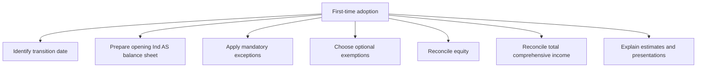
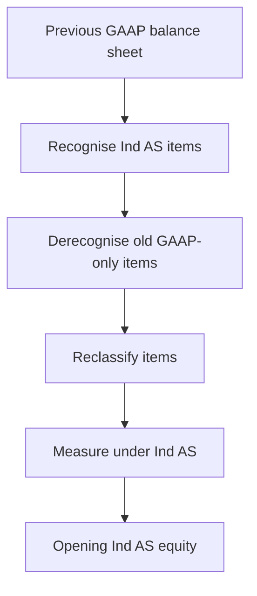
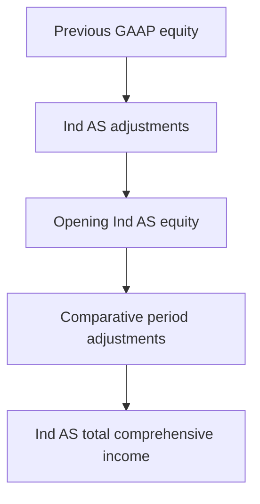

# Chapter 14: Ind AS 101 First-time Adoption of Ind AS

## Exam Relevance

- This chapter is the transition chapter. The examiner uses it to test whether you can move from previous GAAP to Ind AS without smuggling old carrying amounts into the opening Ind AS balance sheet.
- The highest-value points are the date of transition, the opening Ind AS balance sheet, optional exemptions, mandatory exceptions, and reconciliation statements.
- Questions often mix "can we keep the old figure?", "must we restate?", and "what is the first Ind AS presentation date?".
- The answer usually turns on transition logic before accounting mechanics.

## Core Intuition

Ind AS 101 is not a normal measurement chapter. It is a bridge.

The bridge starts from previous GAAP, crosses to Ind AS on the transition date, and then asks:

> "Which old amounts may survive, which must be recalculated, and which must be disclosed in reconciliations?"

## Concept Map



## Key Concepts

### 1. First-time adopter

A first-time adopter is an entity that presents its first Ind AS financial statements and uses Ind AS 101 to move from previous GAAP to Ind AS.

The chapter is about the first full Ind AS reporting cycle, not a later routine Ind AS year.

### 2. Transition date

The transition date is the beginning of the earliest period for which the entity presents full comparative Ind AS information.

That date matters because:

- the opening Ind AS balance sheet is prepared as at the transition date,
- some balances are restated from that date onward,
- reconciliations are built from that date.

### 3. Opening Ind AS balance sheet

The opening Ind AS balance sheet is the starting point of Ind AS accounting.

It is prepared by:

1. recognising all assets and liabilities required by Ind AS,
2. derecognising items not permitted by Ind AS,
3. reclassifying items if Ind AS requires,
4. measuring assets and liabilities under Ind AS principles,
5. recognising the resulting adjustment in retained earnings or another equity component.



### 4. Basic rule

The basic rule is retrospective application of Ind AS, subject to the exemptions and exceptions in Ind AS 101.

That means the default answer is:

> restate as if Ind AS had always applied,

unless Ind AS 101 allows or requires a different route.

### 5. Mandatory exceptions

Mandatory exceptions are the situations where Ind AS 101 does not allow full retrospective restatement.

The examiner usually expects you to identify the exception first, then apply the appropriate transition treatment.

| Mandatory exception | Core idea | Exam trap |
|---|---|---|
| Estimates | Use estimates consistent with what would have been made under Ind AS at the transition date | Do not use hindsight to create perfect estimates |
| Derecognition of financial assets and liabilities | Do not bring back items already derecognised under previous GAAP unless Ind AS requires it | Do not reverse settled transactions just because Ind AS is stricter |
| Hedge accounting | Hedge relationships are not recreated automatically from the past | Past hedge designations do not get a free pass |
| Non-controlling interests | Follow the Ind AS logic for ownership changes and group balances | Do not force old GAAP treatment onto group equity |
| Classification and measurement of financial assets | Classify under Ind AS 109 based on facts at transition | Do not keep old classifications simply because they existed |
| Embedded derivatives | Test them under Ind AS requirements where relevant | Do not ignore embedded features in a compound instrument |

### 6. Optional exemptions

Optional exemptions are the reliefs that may reduce the burden of full retrospective application.

These are one of the examiner's favorite spots because the candidate must notice that an option exists before computing anything.

| Optional exemption | Practical meaning | Usual exam trigger |
|---|---|---|
| Deemed cost for PPE, investment property, and certain intangibles | Use fair value or previous revaluation as a starting point instead of rebuilding historic cost from day one | Old fixed asset register is incomplete or impractical |
| Business combinations | Do not restate every pre-transition combination if the exemption is used | Past acquisitions with old purchase accounting issues |
| Cumulative translation differences | Reset the foreign currency translation reserve if permitted | Foreign operations with long history |
| Investments in subsidiaries, joint ventures, and associates | Use deemed cost routes in separate financial statements | Parent-only books on transition |
| Compound financial instruments | Reclassify transition effects carefully | Old preference shares or convertibles |
| Share-based payment | Apply specific transition logic for unvested awards | ESOP history crossing the transition date |
| Borrowing costs | Use the relief permitted by the standard | Long construction or asset capitalisation history |

### 7. Deemed cost

Deemed cost is the surrogate starting amount used in place of retrospective historic cost.

In exam language:

> "Instead of rebuilding the asset from the first day, Ind AS allows you to start from an approved substitute value."

That substitute might be:

- fair value on transition date,
- previous revaluation amount,
- carrying amount under previous GAAP if permitted,
- or another amount allowed by the exemption.

### 8. Reconciliations

Ind AS 101 requires reconciliations that explain the effect of transition.

The main reconciliations are:

1. equity under previous GAAP to equity under Ind AS at the transition date and at the end of the last previous GAAP period,
2. total comprehensive income under previous GAAP to total comprehensive income under Ind AS for the latest previous GAAP period,
3. material adjustments arising from transition.



### 9. Reconciliation mindset

The reconciliation is not just a numerical formality.

It answers three exam questions:

1. What changed?
2. Why did it change?
3. Where did the change go in equity or profit or loss?

### 10. Comparative information

The comparative period in the first Ind AS financial statements is not a free-form restatement exercise.

It is built from the transition date and the opening Ind AS balance sheet, using the chosen exemptions and mandatory exceptions.

### 11. Presentation traps

The first Ind AS financial statements may need:

- comparative balance sheet,
- comparative statement of profit and loss,
- comparative cash flow,
- notes explaining transition,
- reconciliations of equity and total comprehensive income.

The examiner may ask for the date and content of the opening Ind AS balance sheet before asking any measurement question.

## Professor's Problem-Solving Framework

1. Identify the transition date and first Ind AS reporting date.
2. Prepare the opening Ind AS balance sheet.
3. Apply mandatory exceptions first.
4. Check whether an optional exemption is available and whether the question implies its use.
5. Measure the affected assets and liabilities under Ind AS.
6. Build the equity and profit reconciliations.
7. Write the conclusion in transition language, not old GAAP language.

## Worked Examples

### Example 1: PPE deemed cost

Problem:

An entity's old fixed asset records are incomplete, and the question allows fair value as deemed cost on transition.

Working:

- Do not rebuild the entire historical cost chain.
- Use the permitted fair value as the deemed cost starting point.
- Carry forward depreciation from that deemed cost under Ind AS.

Answer:

Treat the fair value on transition as deemed cost and compute later depreciation under Ind AS.

### Example 2: Reconciliation of equity

Problem:

Previous GAAP equity at transition is 200. Ind AS adjustments increase PPE by 30, reduce inventory by 10, and create a deferred tax liability of 5.

Working:

```text
Net adjustment = +30 - 10 - 5 = +15
Opening Ind AS equity = 200 + 15 = 215
```

Answer:

The opening Ind AS equity becomes 215, assuming no other adjustments.

### Example 3: Mandatory exception on estimates

Problem:

A question gives a more accurate expected credit loss estimate available after the transition date and asks whether it can be used for opening equity.

Working:

- Transition estimates must be based on information available at the transition date.
- Do not use later hindsight just because it is more exact.

Answer:

Use transition-date information, not later hindsight, for estimates.

### Example 4: Foreign currency translation reserve

Problem:

An entity has long-standing foreign operations and the question offers the cumulative translation difference exemption.

Working:

- If the exemption is chosen, the reserve may be reset according to Ind AS 101.
- Later foreign currency translation starts afresh from the elected reset point.

Answer:

Apply the chosen cumulative translation difference exemption and disclose it clearly in transition notes.

## Common Mistakes

- Mixing up the transition date with the first Ind AS reporting date.
- Applying full retrospective restatement even when an exemption is given or implied.
- Using hindsight in estimates.
- Forgetting that reconciliations are part of the answer, not just a footnote.
- Treating optional exemptions as mandatory.
- Forgetting that separate financial statements and consolidated financial statements may have different transition choices.

## Summary Tables

| Topic | Core rule | Exam reminder |
|---|---|---|
| Transition date | Beginning of earliest comparative Ind AS period | This is the anchor date |
| Opening Ind AS balance sheet | Restate on the transition date | Start the bridge here |
| Mandatory exceptions | Must be followed | No hindsight shortcuts |
| Optional exemptions | May be chosen if permitted | Do not forget the option exists |
| Deemed cost | Substitute starting amount | Helpful for PPE and intangibles |
| Reconciliation | Explain equity and profit changes | This is a scoring area |

## Last-Day Revision

- Ind AS 101 is the transition bridge from previous GAAP to Ind AS.
- The transition date anchors the opening Ind AS balance sheet.
- Default rule is retrospective application, subject to Ind AS 101 reliefs.
- Mandatory exceptions must be followed.
- Optional exemptions must be identified before calculation.
- Deemed cost is a permitted surrogate starting amount in some cases.
- Reconciliations of equity and total comprehensive income are essential.
- Do not use hindsight in transition estimates.
- Keep separate books and group books distinct where the exemption choices differ.

## Doubts / Version-Sensitive Items

- Check the exact optional exemptions listed in the source PDF, because the exam may use the ICAI wording rather than a short textbook label.
- Verify the transition-date figures if the question gives a specific reporting calendar, because one date shift changes the whole reconciliation.
- Confirm whether the question wants opening balance sheet numbers, comparative numbers, or both.
- If the source uses a prescribed note format for reconciliations, match that layout exactly.

