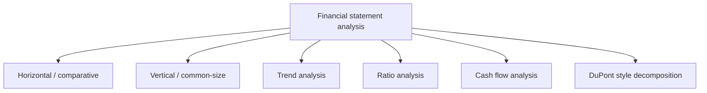
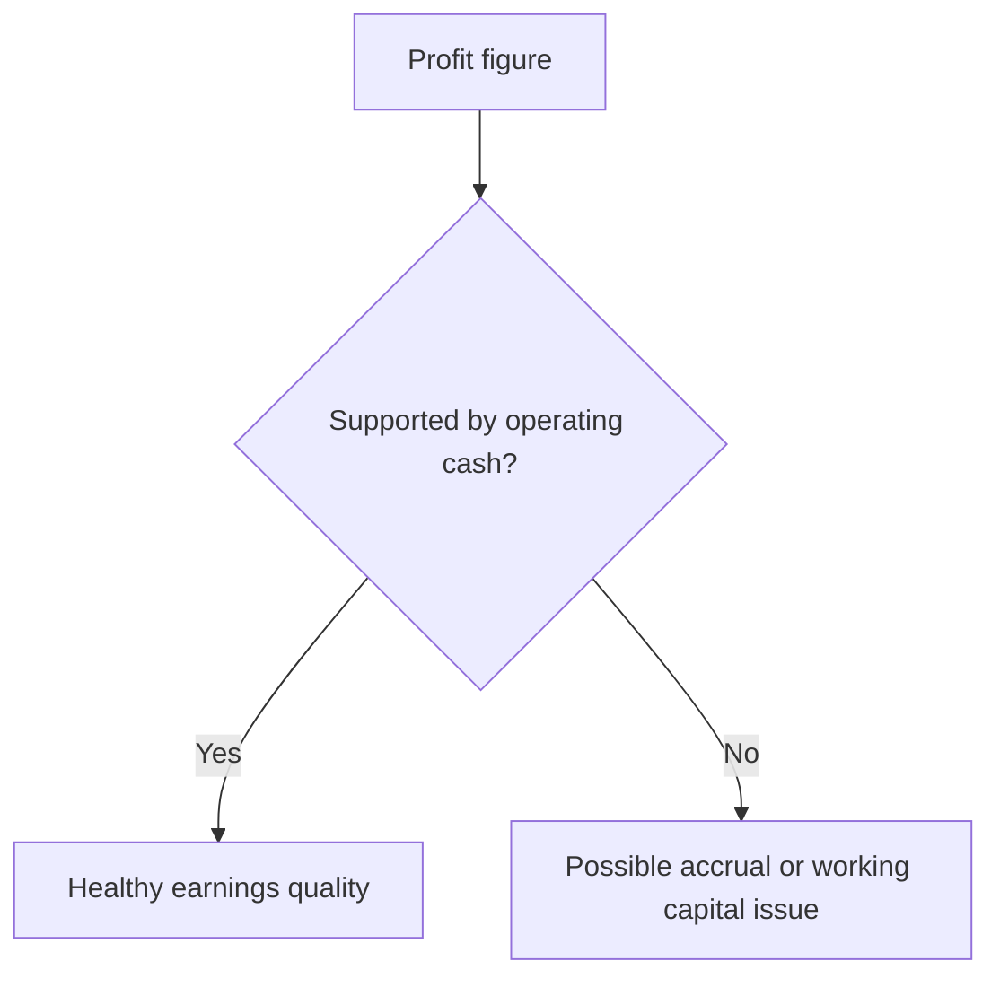

# Chapter 15: Analysis of Financial Statements

## Exam Relevance

- This chapter tests interpretation, not only arithmetic.
- The examiner usually asks you to analyse liquidity, solvency, efficiency, profitability, and cash generation from a set of statements or ratios.
- The trap is to compute a ratio and stop there. The real mark is in the business meaning.
- Questions often require a mix of comparative statements, common-size statements, trend analysis, ratio analysis, and cash flow reading.

## Core Intuition

Financial statement analysis is a detective exercise.

The numbers are the clues, but the answer is the story:

> "Is the entity liquid, profitable, efficient, and financially stable, and is the story supported by cash?"

## Concept Map



## Key Concepts

### 1. Comparative analysis

Comparative analysis compares figures across two or more periods.

It helps answer:

- what increased,
- what decreased,
- and whether the movement is operational, seasonal, or structural.

### 2. Common-size analysis

Common-size analysis expresses figures as a percentage of a base figure.

Typical bases:

- balance sheet items as a percentage of total assets,
- income statement items as a percentage of sales.

This makes the statement easier to compare across companies of different sizes.

### 3. Trend analysis

Trend analysis tracks movement over time.

The base year is usually taken as 100, and later years are compared to it.

It is useful when the examiner wants direction, not only a one-year snapshot.

### 4. Ratio analysis

Ratio analysis compresses financial data into relationship measures.

The common exam families are:

- liquidity,
- leverage or solvency,
- efficiency or activity,
- profitability,
- market-based ratios where relevant,
- cash-flow coverage style measures.

### 5. Cash flow analysis

Profitability and cash generation are not the same thing.

A company can show profits and still be short of cash.

That is why cash flow analysis is the sanity check for the earnings story.



### 6. DuPont thinking

DuPont style analysis breaks return on equity into operating and financing drivers.

The point is not to memorize a fancy label. The point is to ask:

> "Is ROE being driven by margin, asset turnover, or leverage?"

### 7. The three-layer interpretation habit

A good analysis answer normally has three layers:

1. the ratio or comparison,
2. the financial meaning,
3. the likely cause or risk.

That is much stronger than writing only "current ratio increased".

## Ratio Framework

### 1. Liquidity ratios

Liquidity asks whether the entity can meet short-term obligations.

| Ratio | Formula | What it tells you |
|---|---|---|
| Current ratio | Current assets / Current liabilities | General short-term coverage |
| Quick ratio | Quick assets / Current liabilities | Immediate liquidity without inventory |
| Cash ratio | Cash and cash equivalents / Current liabilities | Most conservative liquidity test |

Interpretation rule:

- very low liquidity may signal working-capital stress,
- very high liquidity may mean idle assets or inefficient cash use.

### 2. Solvency and leverage ratios

Solvency asks whether the entity can sustain its debt structure.

| Ratio | Formula | What it tells you |
|---|---|---|
| Debt-equity ratio | Total debt / Equity | Leverage intensity |
| Debt ratio | Total debt / Total assets | Asset funding by debt |
| Interest coverage | EBIT / Interest | Debt-servicing comfort |
| Debt service style coverage | Cash flow / Debt commitment | Repayment ability |

Interpretation rule:

- high leverage can magnify returns,
- but it also magnifies risk when earnings fall.

### 3. Efficiency ratios

Efficiency asks how well assets are used.

| Ratio | Formula | What it tells you |
|---|---|---|
| Inventory turnover | Cost of goods sold / Average inventory | Stock movement speed |
| Receivables turnover | Credit sales / Average receivables | Collection quality |
| Payables turnover | Credit purchases / Average payables | Supplier payment pace |
| Asset turnover | Sales / Total assets | Sales generated per asset unit |

Interpretation rule:

- a slow turnover ratio can mean weak demand, excess stock, or credit control problems,
- but industry pattern matters.

### 4. Profitability ratios

Profitability asks whether the entity converts sales and assets into profit.

| Ratio | Formula | What it tells you |
|---|---|---|
| Gross profit margin | Gross profit / Sales | Pricing and purchase control |
| Operating profit margin | EBIT / Sales | Operating efficiency |
| Net profit margin | Profit after tax / Sales | Bottom-line conversion |
| Return on assets | Profit / Average assets | Asset productivity |
| Return on equity | Profit / Average equity | Return to owners |

### 5. Market-based ratios

These are more relevant when market data is available.

| Ratio | Formula | Use |
|---|---|---|
| EPS | Profit attributable to equity holders / Weighted avg. shares | Per-share profitability |
| P/E ratio | Market price per share / EPS | Market expectation |
| Dividend yield | Dividend per share / Market price per share | Cash return to shareholder |

## Interpretation Patterns

### 1. Liquidity pattern

If current ratio improves because inventory rises sharply, the answer is not automatically positive.

The real question is:

> "Did liquidity improve, or did the balance sheet just get heavier?"

### 2. Profitability pattern

If sales rise but profit margin falls, the business may be buying growth at the cost of margin.

### 3. Solvency pattern

If leverage rises while interest coverage falls, debt risk is increasing even if profit is still positive.

### 4. Efficiency pattern

If receivables turnover slows, operating profit may look fine while cash collection is weakening.

### 5. Cash quality pattern

If profit rises but operating cash flow falls, check:

- receivables build-up,
- inventory build-up,
- higher payables,
- non-cash gains,
- one-off accounting entries.

## Common Adjustments and Cautions

### 1. Comparable base

The same ratio can mean different things in different industries.

Always ask whether you are comparing:

- against prior year,
- against budget,
- against a peer,
- or against an industry norm.

### 2. Average balances

Many ratios are better with average balances than year-end balances.

That is especially true for inventory, receivables, payables, assets, and equity.

### 3. Window dressing

Year-end figures may be polished.

The examiner may quietly expect you to mention:

- temporary debt repayment,
- accelerated collection,
- delayed payments,
- stock reduction before year-end.

### 4. Accounting policy effects

Two entities may have the same economics but different accounting policies.

That affects comparison of:

- depreciation,
- inventory valuation,
- provisions,
- revenue recognition,
- lease treatment,
- impairment.

## Professor's Problem-Solving Framework

1. Identify the type of analysis asked for.
2. Compute the relevant ratio or comparison with consistent figures.
3. Compare against the previous period or target.
4. Explain the movement in business terms.
5. Check cash flow support and accounting policy differences.
6. Finish with a short conclusion on liquidity, solvency, efficiency, or profitability.

## Worked Examples

### Example 1: Current ratio

Problem:

Current assets are 300 and current liabilities are 150.

Working:

```text
Current ratio = 300 / 150 = 2.0
```

Answer:

The entity has 2:1 short-term coverage, which usually suggests comfortable liquidity, subject to the quality of current assets.

### Example 2: Profit quality

Problem:

Profit after tax rises, but operating cash flow falls because receivables increased sharply.

Working:

- Profit is not fully converting into cash.
- Sales may be recorded faster than collections.

Answer:

The earnings quality appears weaker, and working-capital absorption should be checked.

### Example 3: Inventory turnover

Problem:

Inventory turnover falls from 8 times to 5 times.

Working:

- Stock is turning more slowly.
- This may indicate slower sales, overstocking, or production imbalance.

Answer:

Efficiency has weakened, unless the industry or stocking cycle explains the fall.

### Example 4: Debt and coverage

Problem:

Debt-equity rises and interest coverage falls.

Working:

- Leverage has increased.
- Ability to service interest has reduced.

Answer:

Financial risk is higher, even if reported profit is still positive.

### Example 5: Common-size reading

Problem:

Raw sales are up 20%, but operating expenses as a percentage of sales also rise.

Working:

- Scale grew, but cost discipline weakened.

Answer:

Growth is not translating cleanly into operating efficiency.

## Common Mistakes

- Quoting a ratio without explaining what it means.
- Comparing numbers that are not on the same basis.
- Ignoring seasonality or industry norms.
- Treating profit as proof of cash strength.
- Using year-end balances when averages are needed.
- Forgetting that accounting policy changes can distort comparison.

## Summary Tables

| Analysis type | Main question | Best exam move |
|---|---|---|
| Comparative | What moved? | State direction and reason |
| Common-size | What is the structure? | Show percentages and interpret mix |
| Trend | What is the pattern over time? | Use base-year movement |
| Ratio | What relationship matters? | Compute, compare, conclude |
| Cash flow | Is profit supported by cash? | Link earnings to cash quality |
| DuPont | What drives return? | Split return into margin, turnover, leverage |

## Last-Day Revision

- Analysis is interpretation plus computation.
- Always pair ratio with meaning.
- Liquidity is about short-term payment ability.
- Solvency is about debt structure and serviceability.
- Efficiency is about how fast assets move and how well they are used.
- Profitability is about conversion of sales and assets into profit.
- Cash flow is the reality check on profit.
- Industry context and accounting policy matter.
- Window dressing can make a year-end balance sheet look better than the year actually was.

## Doubts / Version-Sensitive Items

- Check whether the source PDF uses a specific ratio set or adds a custom chapter list, because some ICAI editions group the analysis tools differently.
- If a question gives a full set of statements, confirm whether averages or closing balances are expected.
- Verify the exact formula conventions for any ratio the source uses in a tabular answer key.
- Where the question asks for interpretation only, do not over-compute beyond the figures given.

