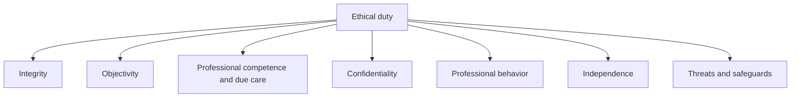
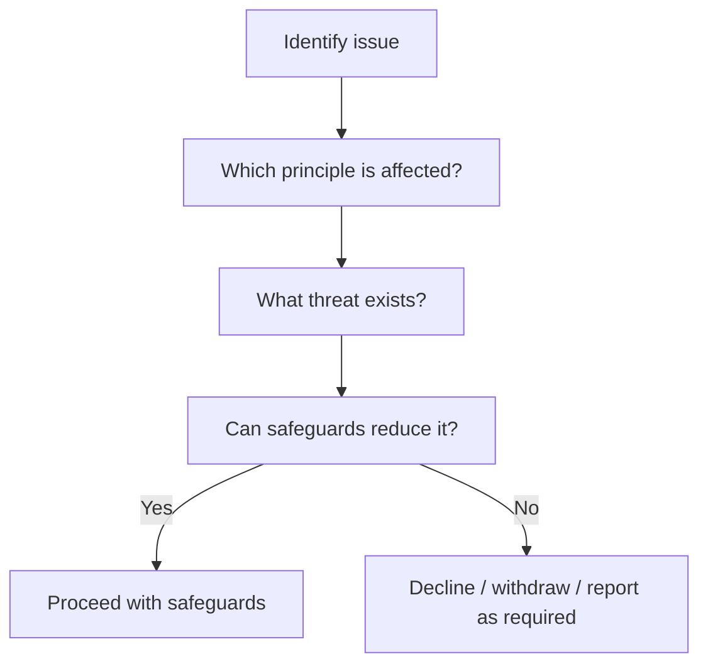

# Chapter 16: Professional and Ethical Duty of a Chartered Accountant

## Exam Relevance

- This chapter is principle-heavy and scenario-driven.
- The examiner usually tests whether you can identify the right ethical principle, the right threat, and the right safeguard.
- The answer often depends on judgment: integrity, objectivity, independence, confidentiality, due care, and professional behavior.
- Many questions are short, but the wrong principle can flip the result.

## Core Intuition

Ethics in accounting is not just about "being good".

It is about protecting trust in financial reporting and professional work.

> A Chartered Accountant must not only be right, but also be seen to be right in a way that the public can trust.

## Concept Map

## Key Concepts

### 1. Integrity

Integrity means being straightforward and honest.

The examiner uses this to test:

- false certification,
- suppression of facts,
- misleading statements,
- and any attempt to make a report say more than the evidence supports.

### 2. Objectivity

Objectivity means not allowing bias, conflict of interest, or undue influence to override professional judgment.

This is the principle that gets stressed when:

- a client pressures the CA,
- a personal relationship exists,
- or fees depend on a favorable outcome.

### 3. Professional competence and due care

The CA must maintain knowledge and skill, and must act carefully and in accordance with technical and professional standards.

This principle is often tested through:

- poor checking,
- careless sign-off,
- relying on outdated rules,
- or handling a specialized issue without proper expertise.

### 4. Confidentiality

Information obtained in professional work should not be disclosed without proper authority unless there is a legal or professional duty to do so.

This is a favorite exam trap because the question may tempt you to think:

> "The information is true, so it can be shared."

That is not the rule.

### 5. Professional behavior

Professional behavior means complying with laws and regulations and avoiding conduct that discredits the profession.

This includes:

- misleading advertising,
- improper solicitation,
- disrespectful conduct,
- and actions that damage professional reputation.

### 6. Independence

Independence matters most in assurance work.

It has two faces:

- independence of mind,
- independence in appearance.

If the public would reasonably doubt the CA's objectivity, the situation may be a problem even if the CA feels personally unbiased.

### 7. Threats to compliance

The examiner often wants the threat before the safeguard.

Common threats include:

| Threat | Meaning | Typical exam clue |
|---|---|---|
| Self-interest | Personal financial or other gain may distort judgment | Fee pressure, investment, success fee |
| Self-review | You may end up reviewing your own work | Same firm does preparation and assurance |
| Advocacy | You may promote the client's position too strongly | Legal dispute, public representation |
| Familiarity | Close relationship may reduce skepticism | Family, long association, personal bond |
| Intimidation | Pressure or threat may influence conduct | Threat of dismissal, complaint, or fee loss |

### 8. Safeguards

Safeguards are actions that reduce a threat to an acceptable level.

They may be:

- created by the profession or law,
- created by the firm,
- or created by the engagement structure.

Examples:

- partner review,
- independent quality review,
- training,
- rotation,
- separate teams,
- withdrawal from engagement,
- consultation with senior professionals.

### 9. Conflict of interest

A conflict of interest exists when professional judgment concerning one client or situation may be compromised by another interest or duty.

The practical answer is often:

1. identify the conflict,
2. disclose it where appropriate,
3. obtain consent if needed,
4. put safeguards in place,
5. withdraw if the threat cannot be reduced.

### 10. Client money, fees and gifts

These are common misconduct areas because they can silently shift objectivity.

Watch for:

- excessive or contingent fees,
- gifts from clients,
- overdue receivables that create leverage,
- money held on behalf of others without proper control.

### 11. Reporting and communication duties

The CA may need to communicate clearly with:

- management,
- those charged with governance,
- a predecessor accountant,
- regulator or authority where law requires,
- or the engagement team internally.

The ethical point is not only what is said, but whether the communication is truthful, complete, and appropriately authorized.

## Ethics Ladder

## Professional Duty Framework

### 1. To the public

The profession exists because the public trusts the numbers.

So the CA must not help create misleading financial information.

### 2. To the client

The CA must serve the client competently, but not at the cost of truth or law.

### 3. To the profession

The CA must avoid conduct that lowers the standing of the profession.

### 4. To regulators and law

Where law requires disclosure, reporting, or compliance, ethics does not permit silence.

## Common Scenario Patterns

| Scenario | Likely principle | What the answer should say |
|---|---|---|
| Client asks to "adjust" numbers to get a loan | Integrity / objectivity | Refuse misleading reporting |
| CA has a financial interest in client | Independence / self-interest | Disclose, eliminate, or withdraw |
| Staff member knows client secrets | Confidentiality | Do not disclose without authority |
| CA signs without checking supporting evidence | Due care | This is poor professional conduct |
| Client threatens to replace CA unless opinion changes | Intimidation | Consider safeguards or withdrawal |
| CA advertises in a misleading way | Professional behavior | Not permitted if it misleads the public |

## Professor's Problem-Solving Framework

1. Identify the professional setting: audit, tax, advisory, compilation, or general conduct.
2. Name the principle being tested.
3. Identify the threat or misconduct element.
4. Check whether any safeguard is realistic.
5. Conclude whether the CA may continue, must disclose, must decline, or must withdraw.

## Worked Examples

### Example 1: Confidentiality

Problem:

A CA learns sensitive sales data while preparing accounts and wants to share it with a friend in another firm.

Working:

- The data was obtained in professional work.
- The friend has no authority.
- No legal exception is stated.

Answer:

Do not disclose the information. Confidentiality applies.

### Example 2: Self-interest threat

Problem:

A CA's fee from a client is overdue, and the client pressures the CA to give a favorable report.

Working:

- The overdue fee creates a self-interest threat.
- The pressure adds intimidation.

Answer:

The threat must be evaluated and safeguarded; if it cannot be reduced, the CA should not continue in the conflicted role.

### Example 3: Due care

Problem:

A CA is asked to certify a specialized tax position without reviewing the supporting records.

Working:

- Signing without evidence is careless.
- The issue needs competence and due care.

Answer:

The CA should obtain the necessary evidence or decline the certification.

### Example 4: Independence

Problem:

An assurance partner's close relative is a senior finance executive of the audit client.

Working:

- The relationship may create familiarity and self-interest concerns.
- Independence in appearance may be impaired.

Answer:

Assess the threat carefully and apply firm-level safeguards or remove the person from the engagement if needed.

## Common Mistakes

- Confusing confidentiality with honesty.
- Thinking that good intention removes a conflict.
- Treating all threats as fatal without considering safeguards.
- Assuming independence is only a personal feeling.
- Forgetting that professional behavior includes public conduct, not just audit work.
- Writing a vague "be ethical" answer instead of naming the principle.

## Summary Tables

| Fundamental principle | What it demands | Usual exam problem |
|---|---|---|
| Integrity | Be honest and straightforward | Misleading statements |
| Objectivity | Do not let bias control judgment | Pressure and conflict |
| Due care | Work carefully and competently | Sloppy sign-off |
| Confidentiality | Protect client information | Unauthorized disclosure |
| Professional behavior | Obey law and protect the profession | Misleading conduct |
| Independence | Keep assurance judgment free from influence | Relationships and interests |

## Last-Day Revision

- Ethics is a principles-and-threats chapter.
- Name the principle first.
- Then name the threat.
- Then ask whether safeguards exist.
- Integrity is about honesty.
- Objectivity is about freedom from bias.
- Due care is about competence and careful work.
- Confidentiality is about not disclosing without authority.
- Professional behavior is about conduct that does not discredit the profession.
- Independence matters most in assurance and also in appearance.

## Doubts / Version-Sensitive Items

- Check the exact ICAI wording for the list of fundamental principles if the question is asking for a definition-style answer.
- Verify whether the source PDF includes specific examples of misconduct or only general duty language.
- If the question mentions a detailed code or disciplinary provision, match the statute or regulation named in the source rather than giving a generic ethical response.

