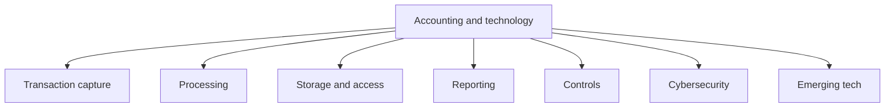
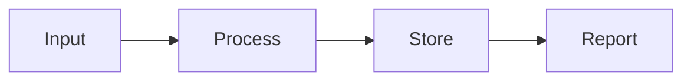
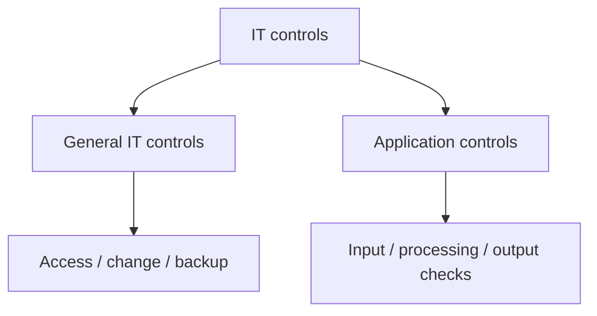

# Chapter 17: Accounting and Technology

## Exam Relevance

- This chapter is about how technology changes accounting processes, controls, risks, and professional work.
- The examiner usually tests systems thinking: what the technology does, what can go wrong, and what control reduces the risk.
- Common themes are ERP systems, cloud accounting, automation, cybersecurity, data integrity, audit trail, access control, and emerging technologies.
- The best answer is usually a mix of technology concept plus control response.

## Core Intuition

Technology makes accounting faster, but also more dependent on systems, permissions, data quality, and cyber discipline.

> If the input is wrong, the system can produce polished wrong numbers very quickly.

## Concept Map

## Key Concepts

### 1. Accounting information system

An accounting information system collects, processes, stores, and reports financial data.

At a simple level it has four steps:

1. input,
2. processing,
3. storage,
4. output.

### 2. ERP systems

Enterprise resource planning systems integrate functions such as:

- accounting,
- inventory,
- purchasing,
- sales,
- payroll,
- and finance.

The advantage is integration. The risk is that one bad control can spread bad data across the whole organization.

### 3. Cloud accounting

Cloud systems store and process data on remote servers accessed over the network.

Benefits:

- remote access,
- scalability,
- easier collaboration,
- faster deployment.

Risks:

- third-party dependence,
- access leakage,
- downtime,
- privacy exposure,
- weaker visibility over where data is stored.

### 4. Automation and RPA

Robotic process automation can automate repetitive tasks such as:

- invoice matching,
- data entry,
- reconciliations,
- report extraction.

The control issue is that automation repeats logic perfectly, including bad logic, unless the process is tested and monitored.

### 5. Artificial intelligence and analytics

AI can support:

- anomaly detection,
- forecasting,
- classification,
- document reading,
- pattern recognition.

But AI output is only as trustworthy as the data and model governance behind it.

### 6. Blockchain and distributed ledgers

Blockchain-based systems can improve traceability and tamper resistance.

Accounting relevance:

- transaction trail,
- shared source of truth,
- transparency in certain workflows.

But blockchain does not automatically solve the problem of bad input or bad governance.

### 7. Cybersecurity

Cybersecurity protects data, systems, and operations from unauthorized access, damage, or disruption.

Common threats:

- phishing,
- malware,
- ransomware,
- credential theft,
- unauthorized access,
- data exfiltration.

### 8. Data governance

Data governance means the rules, responsibilities, and controls for managing data quality and access.

It matters because accounting outputs are only as reliable as the underlying master data, transaction data, and permissions.

### 9. Audit trail

An audit trail is the record that shows who did what, when, and how.

This is critical for:

- accountability,
- fraud detection,
- error investigation,
- compliance.

### 10. General IT controls

General IT controls support the overall reliability of the IT environment.

Examples:

- user access management,
- password and authentication controls,
- change management,
- backup and recovery,
- disaster recovery,
- segregation of duties,
- logging and monitoring.

### 11. Application controls

Application controls operate within a specific accounting application.

Examples:

- input validation,
- completeness checks,
- sequence checks,
- reasonableness checks,
- master file validation,
- exception reports.

## Technology Risk and Control Matrix

| Risk | What can go wrong | Control response |
|---|---|---|
| Unauthorized access | Data theft or tampering | Strong access control, MFA, periodic review |
| Incorrect input | Wrong data enters the system | Validation, maker-checker, source document checks |
| Program error | System processes data wrongly | Change management, testing, approval |
| Data loss | Files disappear or corrupt | Backups, recovery testing, disaster recovery |
| Fraud through override | Users bypass controls | Segregation of duties, logs, exception review |
| Cyber attack | System disruption or ransom | Security monitoring, patching, incident response |
| Interface failure | Data does not move between systems | Reconciliation, interface controls, exception reports |

## Technology in Accounting Process

### 1. Input control

The question may hint at the source of data.

Examples:

- OCR captures invoices,
- POS feeds sales,
- bank feeds import transactions.

If the source input is flawed, the downstream reports will be flawed too.

### 2. Processing control

Processing controls ensure the system applies the correct logic.

Examples:

- tax rates,
- depreciation logic,
- consolidation elimination rules,
- revenue recognition triggers.

### 3. Output control

Output controls ensure the report reaches the right person in the right form.

Examples:

- restricted report access,
- review of exception reports,
- confirmation of report version,
- approval workflow.

## Emerging Technology Themes

### 1. Data analytics

Data analytics helps the accountant spot trends, exceptions, and outliers.

The exam may frame this as a tool for:

- fraud detection,
- performance monitoring,
- risk identification.

### 2. AI-assisted accounting

AI can accelerate document classification and forecasting.

But the human accountant still owns:

- judgment,
- accountability,
- review,
- and final sign-off.

### 3. Continuous monitoring

Systems can be designed to flag issues continuously rather than waiting for period-end review.

This is especially useful for:

- abnormal journal entries,
- duplicate payments,
- limit breaches,
- unusual access patterns.

## Professional Role of the Accountant

Technology does not remove the accountant.

It changes the accountant's job into one that requires:

- understanding systems,
- designing controls,
- evaluating data quality,
- questioning outputs,
- and communicating risk clearly.

## Professor's Problem-Solving Framework

1. Identify the technology in the question.
2. Ask what part of the accounting cycle it affects.
3. State the main risk: access, accuracy, availability, integrity, or confidentiality.
4. Match the risk to a control.
5. Give the practical accounting consequence.

## Worked Examples

### Example 1: Cloud accounting

Problem:

A firm moves accounting records to a cloud platform used by several branches.

Working:

- Access and privacy become more important.
- The entity depends on the provider's uptime and security.

Answer:

Use strong access controls, backup strategy, and vendor oversight.

### Example 2: ERP integration

Problem:

Inventory, sales, and finance are integrated in one ERP.

Working:

- Integration improves consistency.
- A master-data error can affect multiple modules.

Answer:

Use master-file controls, change approval, and reconciliation of key interfaces.

### Example 3: RPA invoice posting

Problem:

A bot posts approved vendor invoices automatically.

Working:

- Speed improves.
- Duplicate or false approvals can be processed quickly if not checked.

Answer:

Use exception reports, periodic bot review, and segregation of duties over bot maintenance.

### Example 4: Cyber incident

Problem:

The accounting system is locked by ransomware.

Working:

- Data availability is interrupted.
- Reporting and operations may stop.

Answer:

Activate incident response, restore from backups, and review access and patching controls.

### Example 5: AI classification

Problem:

AI categorizes expenses and estimates accruals.

Working:

- The model may misclassify unusual items.
- Human oversight remains essential.

Answer:

Use review controls, training data governance, and clear approval thresholds.

## Common Mistakes

- Treating technology as only an efficiency topic and forgetting control risk.
- Thinking cloud means "less control required".
- Believing automation guarantees accuracy.
- Ignoring access management because the system looks modern.
- Confusing general IT controls with application controls.
- Forgetting that accountants still own judgment and accountability.

## Summary Tables

| Topic | Key idea | Exam reminder |
|---|---|---|
| ERP | Integrated process flow | One bad master record can spread |
| Cloud | Remote processing and storage | Third-party and access risk |
| RPA | Repetitive task automation | Bad logic is repeated fast |
| AI | Pattern recognition and prediction | Human review still required |
| Blockchain | Shared and traceable record | Input quality still matters |
| Cybersecurity | Protect systems and data | Access, patching, monitoring matter |
| Audit trail | Trace of actions | Needed for accountability |

## Last-Day Revision

- Technology changes how accounting data is captured, processed, stored, and reported.
- The main risks are access, accuracy, availability, confidentiality, and integrity.
- General IT controls support the whole system.
- Application controls protect specific transactions and reports.
- Cloud, ERP, AI, RPA, and blockchain improve efficiency but do not remove the need for control.
- A polished output is not proof of correct input.
- The accountant's judgment remains central.

## Doubts / Version-Sensitive Items

- Check whether the source PDF emphasizes specific Indian regulatory wording for data privacy, cyber risk, or IT controls.
- If the question names a specific technology, match the risk and control to that technology rather than giving a generic IT answer.
- Verify whether the booklet prefers a control classification in terms of preventive, detective, and corrective controls.

