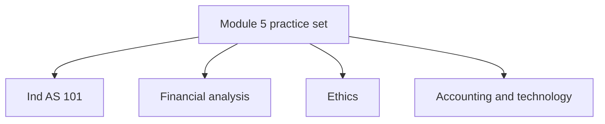
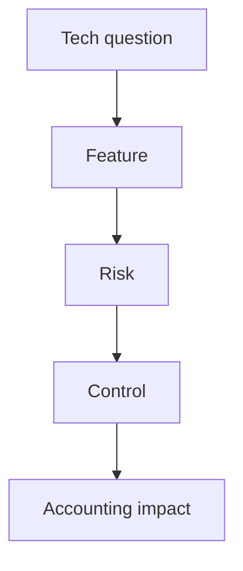

# Module 5 Practice Questions Pattern Guide

## Exam Relevance

This practice set is a mixed revision pack for the tail end of Module 5.

The examiner can jump between:

- first-time adoption,
- financial statement analysis,
- professional ethics,
- and accounting technology.

The trick is to classify the family first, because the style of answer changes with the chapter.

## Core Intuition

Module 5 practice questions reward fast topic identification and a clean exam structure more than long theory dumps.

## Concept Map

## Question Pattern Map

| Pattern | How to Recognize It | Core Solving Move |
|---|---|---|
| Transition question | Previous GAAP, opening balance sheet, first Ind AS year, reconciliation words appear | Fix transition date and then apply exemptions and exceptions |
| Deemed cost question | Old asset records, fair value, revaluation, tax base, opening Ind AS asset value | Decide whether deemed cost is allowed and what starting amount is used |
| Reconciliation question | Equity and total comprehensive income under both frameworks | Build bridge from previous GAAP to Ind AS |
| Ratio question | Current ratio, turnover, leverage, margin, cash flow, trend words appear | Compute the ratio, then interpret the business signal |
| Common-size / trend question | Percentage comparisons or base-year movement | Explain structure or direction, not only numbers |
| Ethics scenario | Pressure, independence, confidentiality, conflict, gifts, fees | Name the principle, threat, safeguard, conclusion |
| Tech/control question | ERP, cloud, automation, cyber, access, audit trail | Match the system feature to the control risk |

## Pattern Blocks

### 1. Ind AS 101 pattern

These questions often use verbs like:

- restate,
- convert,
- transition,
- opening balance sheet,
- first-time adopter,
- exemption,
- exception.

The expected order is usually:

1. identify transition date,
2. decide if an exemption is used,
3. apply mandatory exceptions,
4. calculate opening equity adjustment,
5. present reconciliations.

### 2. Analysis pattern

The chapter may ask you to:

- compute one ratio,
- compare two years,
- comment on liquidity or profitability,
- or interpret a set of statements.

The examiner likes the sentence:

> "The ratio changed, but the real story is ..."

### 3. Ethics pattern

The ethics question usually contains a conflict in plain sight.

Clues:

- client pressure,
- fee issue,
- relationship issue,
- confidentiality issue,
- misleading communication,
- independence problem.

The answer should be built as:

1. principle,
2. threat,
3. safeguard,
4. whether to proceed.

### 4. Technology pattern

Technology questions usually ask about:

- what the system does,
- what risk it introduces,
- what control reduces the risk,
- what the accountant should watch for.

## Chapter-Specific Quick Moves

| Chapter | Best first move | Common trap |
|---|---|---|
| Ind AS 101 | Identify transition date and opening Ind AS balance sheet | Using hindsight or forgetting a permitted exemption |
| Analysis | Decide whether the question wants liquidity, profitability, efficiency, or solvency | Quoting a ratio without meaning |
| Ethics | Name the principle before discussing facts | Writing a generic moral answer |
| Technology | Match technology type to control risk | Talking about features but ignoring controls |

## Mini Examples

### Example 1: Transition set-up

Question style:

"Prepare the opening Ind AS balance sheet and show the equity reconciliation."

Expected move:

- Start from previous GAAP equity.
- Identify Ind AS adjustments.
- Apply any exemption that changes the opening amount.
- Show the bridge.

### Example 2: Ratio interpretation

Question style:

"Current ratio improved, but operating cash flow fell."

Expected move:

- State the ratio movement.
- Explain that cash quality may still be weak.

### Example 3: Ethics scenario

Question style:

"A CA is asked to sign a certificate while a fee remains overdue."

Expected move:

- Identify self-interest and intimidation threats.
- Consider safeguards.
- Decide whether continued engagement is acceptable.

### Example 4: Technology scenario

Question style:

"An ERP update caused several reports to change overnight."

Expected move:

- This is a change-management and test-control issue.
- Say that approval, testing, and rollback controls are required.

## Common Mistakes

- Starting with computation before spotting the topic family.
- Using old GAAP logic after the question says first-time adoption.
- Treating every ratio as a sign of health.
- Writing "be ethical" without naming the principle.
- Describing technology without a control response.
- Forgetting to mention the business meaning in analysis answers.

## Summary Tables

| If you see this | Think this | Then do this |
|---|---|---|
| Previous GAAP / opening balance sheet | Ind AS 101 | Test exemption and exception logic |
| Sales, margin, assets, debt | Analysis | Compute, compare, interpret |
| Pressure, confidentiality, gifts | Ethics | Principle, threat, safeguard |
| ERP, cloud, cyber, automation | Technology | Risk, control, impact |

## Last-Day Revision

- Module 5 practice questions are mixed, but the topic family is usually obvious if you slow down for two seconds.
- For Ind AS 101, transition date and reconciliations are the anchor.
- For analysis, the ratio is only half the answer.
- For ethics, principle first and safeguard second.
- For technology, feature first and control second.
- The cleanest answer is the one that follows the standard's logic in order.

## Doubts / Version-Sensitive Items

- Check whether the source practice PDF groups questions chapter-wise or mixes them fully across the module.
- If the PDF uses a specific answer format, mirror that format for final revision.
- Verify whether the practice set expects note-style answers or direct one-line conclusions for shorter questions.

