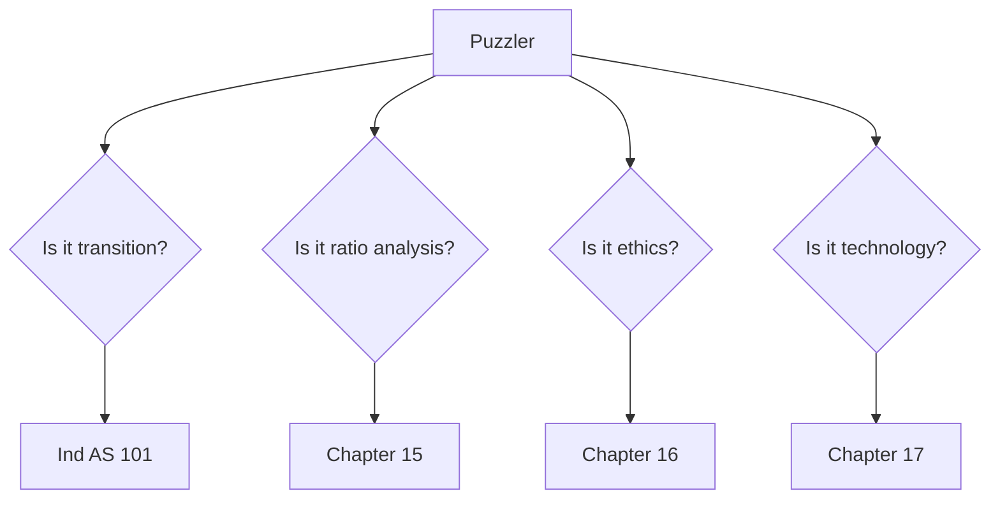
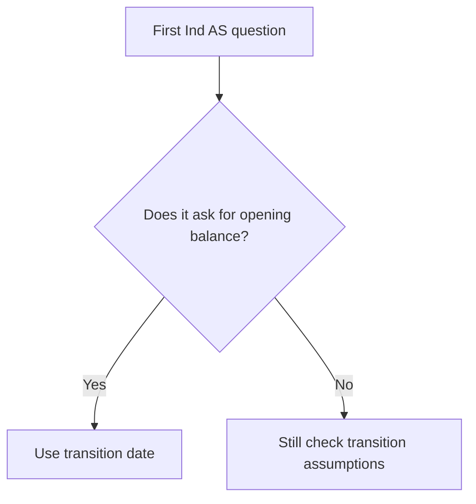

# Module 5 Ind AS Puzzlers - Trap Guide

## Exam Relevance

This is the quick-warning sheet for the short Module 5 questions that look harmless but are built around a trap.

The usual traps are:

- transition-date traps,
- exemption-versus-exception traps,
- ratio-interpretation traps,
- ethics principle traps,
- and technology-control traps.

## Core Intuition

The safest question to ask is:

> "What exactly am I being asked to classify before I calculate or conclude?"

## Concept Map

## Trap Patterns

| Trap | What the question is trying to trick you into doing | Correct response |
|---|---|---|
| Transition date confusion | Using the first Ind AS reporting date instead of the transition date | Fix the transition date first |
| Optional exemption ignored | Rebuilding historic cost when a permitted deemed-cost route exists | Check whether the exemption is available and implied |
| Mandatory exception missed | Restating an item that Ind AS 101 says must follow special treatment | Apply the exception before the calculation |
| Reconciliation skipped | Giving only the adjusted number, not the bridge | Show the equity or profit reconciliation |
| Ratio without context | Treating a ratio increase as automatic improvement | Interpret the business cause and cash support |
| Ethics by vibe | Saying "this is not proper" without naming the principle | State the principle, threat, safeguard |
| Technology without controls | Explaining ERP, cloud, or AI features only | Add the risk and the matching control |

## Fast Decision Rules

### 1. Transition trap rule

If the question mentions the first Ind AS statements, go to transition logic first.

### 2. Ratio trap rule

If the ratio moved in a good direction, still ask:

- did working capital worsen,
- did debt increase,
- did cash weaken,
- or is the industry moving the same way?

### 3. Ethics trap rule

If the situation involves pressure, money, or relationships, the principle is probably one of:

- objectivity,
- independence,
- confidentiality,
- due care,
- or professional behavior.

### 4. Technology trap rule

If the system sounds modern, do not assume it is safe.

Ask what could go wrong and what control catches it.

## Mini Examples

### Example 1: Transition trap

The question says the entity will present its first Ind AS financial statements for the year ended 31 March 2026 and asks about the opening balance sheet as at 1 April 2024.

Answer:

Use 1 April 2024 as the transition date if that is the earliest comparative period, not 31 March 2026.

### Example 2: Ratio trap

Current ratio rises from 1.4 to 1.8 because inventory increases sharply.

Answer:

Do not call it an automatic improvement. Check whether the stronger ratio is just tied up in slower-moving stock.

### Example 3: Ethics trap

A client offers a gift after the CA signs a clean report.

Answer:

This is a threat to objectivity and professional behavior. Consider firm policy and safeguards.

### Example 4: Technology trap

An AI tool classifies invoices and posts expenses.

Answer:

Do not stop at "efficiency". Mention classification error risk, access control, review, and exception monitoring.

## Common Mistakes

- Using the wrong anchor date in Ind AS 101.
- Confusing optional relief with compulsory treatment.
- Writing a ratio number but no conclusion.
- Saying "there is confidentiality" without asking whether disclosure is authorized.
- Treating automation as a control substitute.
- Forgetting that appearance matters in independence questions.

## Summary Tables

| Standard | What to check first | Usual trap |
|---|---|---|
| Ind AS 101 | Transition date and exemption logic | Hindsight and date mix-up |
| Chapter 15 | Trend, ratio, cash support | Ratio without interpretation |
| Chapter 16 | Principle and threat | Generic moralizing |
| Chapter 17 | Risk and control | Feature-only answer |

## Last-Day Revision

- Transition questions start with the opening Ind AS balance sheet.
- Ratio questions start with meaning, not just numbers.
- Ethics questions start with the affected principle.
- Technology questions start with the risk, then the control.
- The shortest question is often the one with the sharpest trap.

## Doubts / Version-Sensitive Items

- Verify whether the source puzzler PDF uses the same chapter order as the study notes or groups the questions by trap type.
- Check whether the examples in the source use specific numbers or only concept prompts, because that affects how much arithmetic you need in revision.
- If a puzzle references a named technology or a specific ethics provision, match that wording exactly in the final exam answer.

