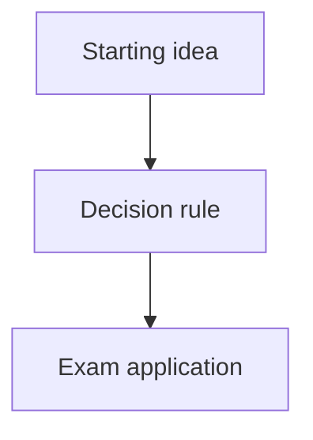

# CA Exam Note Creation

Create an ordered Markdown study set from CA exam PDFs or an official source page. Preserve source order, explain concepts like a professor, focus on exam-solving intuition, and validate outputs against the source material.

## When To Use

Use this skill when the user asks to:

- Convert ICAI or CA exam PDFs into Markdown study notes.
- Build chapter-wise notes with intuition, examples, diagrams, and exam frameworks.
- Download or organize PDFs from an official study material page.
- Use an orchestrator, chapter subagents, and QA subagents for large note-creation work.
- Repeat the workflow used for the ICAI Final Paper 1 May 2026 study notes.

## Summary Of The Completed Reference Workflow

In the reference project, the workflow produced:

- A professor-style Markdown note for Chapter 11, International Financial Management.
- An ordered download set from the ICAI source page `https://www.icai.org/post/sm-final-p1-may2026`.
- A verified PDF corpus of 63 PDFs, preserving the website order.
- An ordered source manifest and README for the downloaded PDFs.
- A complete Markdown study-notes set for all 63 PDFs.
- A master index, style/template file, progress tracker, doubts/version-sensitive log, and QA reports.
- Module-level QA and follow-up fixes for coverage, examples, diagrams, Markdown formatting, encoding artifacts, and source-sensitive caveats.

Final artifact pattern:

```text
<source_pdf_folder>/
  README.md
  urls.tsv
  downloaded PDFs...

<study_notes_folder>/
  00_Master_Index.md
  00_Style_and_Template.md
  00_Doubts_and_Version_Sensitive_Items.md
  progress_tracker.md
  01_Module_1/
  02_Module_2/
  03_Module_3/
  04_Module_4/
  05_Module_5/
  99_QA_Reports/
```

## Core Workflow

### 1. Source Discovery

Start by identifying the source material:

- If the user provides a folder, list all PDFs and infer the intended order from filenames, module folders, or document metadata.
- If the user provides a website, download or inspect the page, extract all PDF links, and preserve the order shown on the page.
- Prefer official sources for CA exam content.
- Create a manifest with sequence number, title, source URL, and local path.
- Verify downloaded files are real PDFs by checking the `%PDF-` header where practical.

Do not silently reorder chapters alphabetically if the official page or source folder implies another order.

### 2. Create The Workspace Structure

Before drafting notes, create or update:

- `00_Master_Index.md`: links to all notes in source order.
- `00_Style_and_Template.md`: the writing and formatting standard for all subagents.
- `progress_tracker.md`: per-PDF status, owner, QA status, and final status.
- `00_Doubts_and_Version_Sensitive_Items.md`: source-sensitive, law-sensitive, standard-sensitive, or unclear items.
- `99_QA_Reports/`: one pilot report and then module or batch reports.

Use numeric prefixes in filenames and folders so the final set remains stable and navigable.

### 3. Pilot Before Scaling

Draft 3 to 5 representative notes first:

- One normal conceptual chapter.
- One highly technical or standard-heavy chapter.
- One practice-question or case-study file.
- One puzzle, illustration, or special-format file if present.

Run QA on the pilot before scaling. Fix the template, diagrams, examples, and caveat style based on the pilot findings.

### 4. Subagent Strategy

If the user explicitly requests subagents, use a wave-based workflow.

Roles:

- Orchestrator: owns the master plan, output format, progress tracker, index, and final integration.
- Chapter subagents: each handles one PDF or a small disjoint batch; each owns specific output paths.
- Practice subagents: convert question sets into pattern guides rather than reproducing all questions.
- QA subagents: validate notes against source PDFs, checking omissions, weak examples, over-summary, style drift, diagrams, and source-sensitive items.

Subagent prompts should include:

- Exact source PDF paths.
- Exact output Markdown paths.
- The template file path.
- Ownership boundaries.
- A reminder not to revert or overwrite other agents' work.
- A requirement to report changed files, doubts, and unresolved items.

Use waves if there is an active-subagent limit. Close completed agents when their output is integrated.

### 5. Chapter Note Template

For concept chapters, use this structure:

````markdown
# <Chapter / Unit Title>

## Exam Relevance

## Core Intuition

## Concept Map



## Key Concepts

## Professor's Problem-Solving Framework

## Worked Examples

## Common Mistakes

## Summary Tables

## Last-Day Revision

## Doubts / Version-Sensitive Items
````

Use Mermaid diagrams where they clarify relationships, processes, decision trees, or exam-solving logic.

### 6. Practice Guide Template

For practice-question PDFs, do not reproduce every question unless the user explicitly asks. Convert them into pattern-based exam guides:

```markdown
# <Practice Guide Title>

## Exam Relevance

## Core Intuition

## Concept Map

## Question Pattern Map

## Solving Frameworks

## Worked Mini Examples

## Common Mistakes

## Last-Day Practice Checklist

## Doubts / Version-Sensitive Items
```

Focus on how to recognize question types, choose the right method, avoid traps, and write exam-ready answers.

### 7. Writing Standard

Write like a professor preparing a CA exam student:

- Start with intuition before formulas or rules.
- Explain why a method works, not only what to do.
- Use compact worked examples with numbers where helpful.
- Highlight triggers: "When you see X, think Y."
- Include common mistakes and examiner traps.
- Prefer tables for comparisons and decision rules.
- Use diagrams for flows, classifications, and problem-solving sequences.
- Keep legal, accounting-standard, tax, and institute-specific wording cautious when exact source wording matters.

Do not over-summarize. The notes should be useful for solving questions, not just remembering headings.

### 8. QA Checklist

For each note or batch, validate:

- Coverage: all major source headings and exam-relevant concepts are represented.
- Accuracy: formulas, definitions, classifications, and steps match the source.
- Examples: at least one clear worked or mini example for important computational or judgment areas.
- Intuition: the note explains the underlying logic, not only the final rule.
- Diagrams: complex chapters include useful concept maps or decision flows.
- Style consistency: headings and tone match the template.
- Markdown quality: no broken code fences, encoding artifacts, BOM characters, or malformed inline code.
- Version-sensitive flags: law, standards, rates, institute material, or regulatory items are marked where they may need checking.

Create a QA report with:

- Files reviewed.
- Issues found.
- Fixes applied.
- Remaining doubts.
- Residual risk.

### 9. Final Integration

Before calling the work complete:

- Count source PDFs and Markdown note files.
- Confirm every source sequence number has a corresponding note.
- Check for empty or suspiciously tiny notes.
- Regenerate the master index and progress tracker from actual files.
- Confirm QA reports exist.
- Summarize unresolved doubts and version-sensitive items.
- Give the user a concise final summary with the key output paths.

## Full Prompt To Repeat This Task

Use this prompt when asking Codex to repeat the workflow:

```text
Use the CA Exam Note Creation workflow.

Source material:
- Official page or folder: <PASTE URL OR LOCAL FOLDER PATH>
- Exam/course: <EXAM NAME, PAPER, ATTEMPT, MODULES>
- Output folder: <DESIRED OUTPUT FOLDER>

Goal:
Create an ordered Markdown study set from all PDFs. The notes should prepare me for the CA exam in India. Write like a professor in the subject: explain the concepts, give the fundamental intuition, include examples, highlight exam triggers, and show how to solve likely questions.

Workflow:
1. First discover and organize all PDFs in the exact order of the official source or folder.
2. Create a manifest with sequence number, title, source URL or local path, and intended Markdown output path.
3. Verify downloaded PDFs when applicable.
4. Create the study-notes structure:
   - 00_Master_Index.md
   - 00_Style_and_Template.md
   - progress_tracker.md
   - 00_Doubts_and_Version_Sensitive_Items.md
   - chapter/module folders
   - 99_QA_Reports/
5. Pilot 3 to 5 representative PDFs first, including at least one normal chapter, one technical chapter, and one practice-question file if available.
6. QA the pilot against the original PDFs, fix the template and style, then scale to all PDFs.
7. Use a subagent workflow:
   - One orchestrator owns the master plan, index, tracker, style consistency, and final merge.
   - Many chapter subagents each handle one PDF or a small disjoint batch.
   - Practice subagents convert practice PDFs into pattern-based solving guides rather than simply reproducing questions.
   - QA subagents validate batches against the source PDFs and look for omissions, weak examples, style drift, over-summary, Markdown issues, and version-sensitive items.
8. For each concept chapter, include:
   - Exam Relevance
   - Core Intuition
   - Concept Map using Mermaid where useful
   - Key Concepts
   - Professor's Problem-Solving Framework
   - Worked Examples
   - Common Mistakes
   - Summary Tables
   - Last-Day Revision
   - Doubts / Version-Sensitive Items
9. For each practice-question PDF, include:
   - Question Pattern Map
   - Solving Frameworks
   - Worked Mini Examples
   - Common Mistakes
   - Last-Day Practice Checklist
10. Finalize by checking:
   - PDF count equals note count
   - every source prefix has a note
   - no note is empty or too small
   - QA reports exist
   - index and tracker are regenerated from actual files
   - doubts and version-sensitive items are summarized

Important constraints:
- Preserve the official source order.
- Do not overwrite unrelated user files.
- Do not revert changes made by other agents or the user.
- Keep all chapter workers on disjoint output paths.
- Flag uncertain or version-sensitive material instead of pretending certainty.
- Make the notes useful for solving CA exam questions, not just reading summaries.

Final deliverables:
- Ordered PDF/source manifest.
- Complete Markdown study-notes folder.
- Master index.
- Progress tracker.
- Doubts/version-sensitive log.
- QA reports.
- Concise final summary of work completed and remaining caveats.
```
